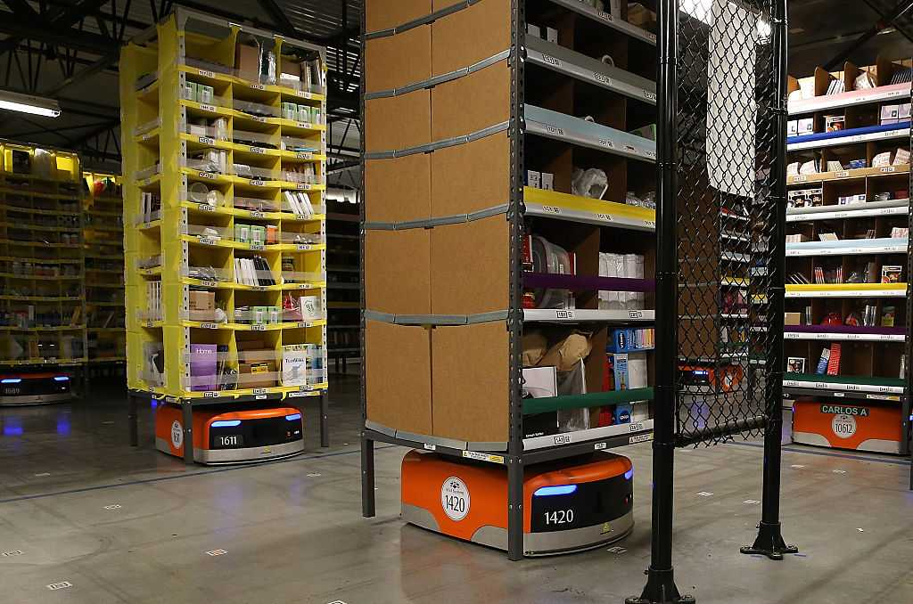
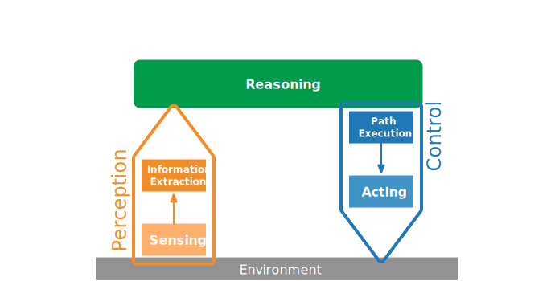
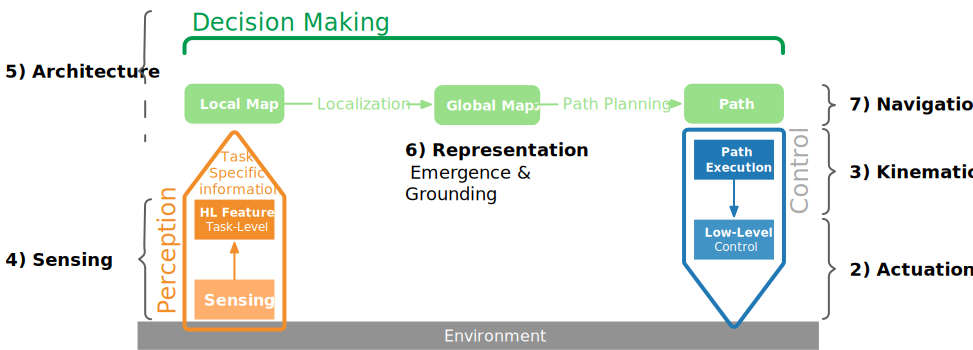

# Automatisierung: Roboter für spezifische Anwendungen

{height=450px}

Structured Environments -- Fixed Set of Tasks -- Pre-programmed Procedures

# General-Purpose Autonomous Robots

{height=450px}

Unstructured Environments -- Ever-changing Tasks -- Human Involvement

# Robotics today

:::col30
{width=240px}
:::

:::col70

We are seeing more and more robots and intelligent systems coming into our lives.

:::

[:vspace](40px)

* What are examples?
* What are obstacles for robots today? 
* Where do they struggle?

# Robotics Today -- Toyota in 2023

<!--{height=480px .controls .autoplay}-->

[Toyota Robotics Institute 2023](https://youtu.be/tPmxGhddcVY)

# What is this Course about? Control in Autonomous Robots

{height=480px}

# For whom is this -- Expected background knowledge

* NO background in robotics is required
* Basic knowledge of physics
	* concepts of gravity, acceleration, force ...
* Linear algebra
	* vector and matrix operations, systems of linear equation, basic differential calculus ... 
* Probability calculus
	* conditional probability, conditional independence, ...
* General understanding of electrical engineering concepts

# Overview today

1. Automation to Autonomous System
2. The notion of Autonomy
3. State-of-the-Art in Robotics
4. Perception-Reason-Action Loop
5. Lecture Overview

# My own research

::: columns-60-40

- Interest in understanding and modelling autonomous intelligent systems.
- Understanding how agents can perform autonomously in an environment -- meaning: interacting with an environment and dealing with unstructured environments. Towards interacting with other agents and cooperation.
- Locomotion and Manipulation as two prime examples for dealing with an unpredictable environment in an adaptive way.

{ height=500px}

:::

# History of Robotics {.section data-background-color="#6A931C"}

# History of Automation

Started with the industrial revolution (first in England): 1769 the Steam engine and followed by automatic loom.

{height=400px}

Figure from https://www.calsoft.com/what-is-industry-4-0/

# 1804 -- Automation {.columns}

## The “Jacquard Loom” {.left}

Invented by Joseph-Marie Jacquard: 

* Translated patterns from punch cards into commands that determined the lifting and lowering of threads
* The loom became the first widely used system that could follow a program.
* Increased speed by more then 20 times.

## {.right}

{width=640px .controls .autoplay}

Video: Henry Ford Museum

# 1921 -- The Term "Robot" {.columns}

##  {.left}

In his play “R.U.R.: Rossum’s Universal Robots,” the Czech writer Karel Čapek tells the tale of a factory in which thousand synthetic humanoids have been created and work.

Čapek named the devices “robots,” after the Czech word robota, referring to the forced labor.

## {.right}

{width=640px .controls .autoplay}

# 1942 -- Laws of Robotic

Three Laws of Robotics -- introduced by Isaac Asimov (1942) in short story "Runaround" which are widely considered as organizing principle and standards for robots:

:::incremental

1. A robot may not injure a human being or, through inaction, allow a human being to come to harm.
2. A robot must obey the orders given it by human beings except where such orders would conflict with the First Law.
3. A robot must protect its own existence as long as such protection does not conflict with the First or Second Law.

:::

Asimov had a much more positive and optimistic opinion of the robot's role in human society compared to Čapek.  He generally characterized robots as helpful servants of man and viewed robots as "a better, cleaner race." 

# 1949 -- an autonomous navigating robot pair {.columns}

##  {.left}

William Grey Walter introduced a pair of battery-powered, tortoise-shaped robots **(Elmer and Elsie)** that could maneuver around objects in a room, guide themselves toward a source of light and find their way back to a charging station.

Control is based on: sensor technology, a responsive feedback loop, and logical reasoning.

## {.right}

{width=640px .controls .autoplay}

Video: Dr. F. W. and J. Merlyn Clutterbuck/National Museum of American History.

# 1959 -- Application of first robotic arm in factory {.columns}

## Unimate {.left}

Introduced into a General Motors plant:

* move up and down, rotate with a rotatable, pincer-like gripper,
* lifting and stacking hot, die-cut metal parts, which was too taxing or dangerous for humans (75-pound loads and working amid toxic fumes)
* could follow a program of up to 200 movements 

## {.right}

{width=640px}

Photo: Kawasaki

# 1969 -- The Stanford Arm {.columns}

##  {.left}

First Small, Electric-Powered Six-Axis Robot, designed by Victor Scheinman.

* could move much more quickly than previous robots, 
* electric instead of hydraulics,
* six axes of movement (degrees of freedom),
* first robotic arm to be controlled by software in a computer.

## {.right}

{height=480px}

Photo: Les Earnest/Stanford Robotics Group

# 1972 -- First Artificial Intelligent Robot {.columns}

## Shakey - Planning Robot{.left}

* build model of environment using TV camera, range finder and touch-sensitive metal whiskers, 
* use a “planning” program to generate next move,
* execute move.
* could navigate its way across a room or pushing a box along the floor.

## {.right}

{width=640px .controls .autoplay}

Video: The Stanford Library

# Onwards: more dexterous robot arms {.columns}

## 1978 SCARA {.left}

The “Selective Compliance Assembly Robot Arm”

* engineered simply to pick something up, swivel around, and plop it down with precision,
* very fast "pick-and-place" robot.

## {.right}

{height=480px}

Photo: Yamanashi University in Japan.

# 2000 Sociable Robot Kismet {.columns}

##  {.left}

A robotic head designed to provoke — and react to — emotions.

* 21 motors control eyebrows, lips, ears, and big eyes, 
* allowing Kismet to express a range of emotions, from happy to bored. 
* Audio sensors and algorithms pick up vocal tone.

With Kismet CynthiaBreazeal demonstrated the influence of a robot as a personality.

## {.right}

{height=480px .controls .autoplay .loop}

Video: Sam Ogden/Science Source.

# 2002 Roomba {.columns}

##  {.left}

iRobot, founded by a group of MIT researchers in 1990, introduced a robotic vacuum. 

* Original research for U.S. military on a robot to check areas for land mines. 
* The algorithm enabled a robot to explore a whole given space. 
* This was the first functional robot that was widely adopted in households.

## {.right}

{height=480px .controls .autoplay .loop}

# Robots in warehouses {.columns}

## 2003 Kiva Robot {.left}

* a squarish bot that moves around warehouses, moving racks of goods, 
* inexpensive, but moves less precisely,
* compensated with software for course-correction, 
* more flexible than a conveyor-belt system.

Bought by Amazon in 2012

## {.right}

{height=480px}

Photo: Getty Images.

# From Automation to Autonomy {.section data-background-color="#6A931C"}

# Autonomy

## Autonomy {.definition}

Derived from greek: 'one who gives oneself their own law'.

An autonomous robot is a machine that can operate and perform tasks by itself without continuous human guidance [@broadbent_interactions_2017].

##

> Robots are considered to be autonomous when they make decisions in response to their environment (rather than simply following a pre-programmed set of motions) **[@correll2023]**. 

# Autonomy in Robots

Robots achieve this using a multitude of modern techniques:

* signal processing, 
* control theory, 
* artificial intelligence, and more. 

These techniques are tightly intertwined with the mechanics, the sensors, and the actuators of the robot.

# Degrees of Autonomy

{width=800px}

## {.footer}

[@goodrich2007]

# Distinction degrees of autonomy {.columns}

## Automation {.left}

{height=240px}

## Cognitive Robot {.right}

{height=240px}

## {.bottom}

{width=800px}

## {.footer}

[@vernon_course]

<!--
# Comparison of Robots

:::incremental
* Much of classical robotics is about successfully automating repetitive actions in the presence of a carefully prepared environment (e.g., a production floor). 

* To make that feasible, a major strategy is to minimize the impact of unforeseen conditions by minimizing interaction between the robot and its environment. 

* On the other hand, for cognitive robots, interaction with their environment is a large part of their function. 

* Moreover, the relevant environments are often characterized by a high degree of variability and uncertainty. 

:::

-->

# Distinction degrees of autonomy {.columns}

## Controlled Environment {.left}
We know what to expect -- characterized by repitition.

Robots can be pre-programmed to do what we want in detail.

## Complex Environment {.right .fragment}
We don’t know what to expect. 

Characterized by uncertainty, noise, incomplete knowledge and change.

Cognitive robots have to be flexible and adaptable.

[@vernon_course]

# Degrees of Autonomy 

{width=1200px}

## {.footer}

[https://blog.netapp.com/how-to-build-a-data-pipeline-for-autonomous-driving/amp/](https://blog.netapp.com/how-to-build-a-data-pipeline-for-autonomous-driving/amp/)

# Example: Waymo
Scene Representation in Autonomous Driving 

:::{align="center"}
<iframe width="800" height="450" src="https://www.youtube.com/embed/B8R148hFxPw" frameborder="0" allow="accelerometer; autoplay; encrypted-media; gyroscope; picture-in-picture" allowfullscreen></iframe>
:::

# Levels of Autonomy

:::r-stack

{height=480px .fragment}
{height=480px .fragment}
{height=480px .fragment}
{height=500px .fragment}

:::

## {.footer}

[@gransche2014wandel]

# Spectrum of Levels of Autonomy in Interaction {.columns}

## Adaptive Behavior {.left}

{width=600px}

## Cognitive Behavior {.right}

{width=600px}

[@schilling2016towards]

# Discussion Break  {.section data-background-color="#FF6600"}

# Autonomous everything ... {.columns}

## {.top}

:::col30
{width=240px}
:::

:::col70

Autonomy as well as Artificial Intelligence are now a buzzword added to many things:

- Consider in what sense these are autonomous.
- How would you differentiate autonomy from AI?

:::

## Beer Outdoor Transport {.left}

{width=400}

## Autonomous Beer {.center .fragment}

{width=400}

## ChatGPT {.right .fragment}

{width=400}

# Intelligent Agent
<!--
## Agent {.definition}

"An agent is just something that acts (agent comes from the Latin agere, to do). Of course, all computer programs do something, but computer agents are expected to do more: 

* operate autonomously, 
* perceive their environment, 
* persist over a prolonged time period, 
* adapt to change, and 
* create and pursue goals. 

A rational agent is one that acts so as to achieve the best outcome or, when there is uncertainty, the best expected outcome."
-->

An intelligent agent perceives its environment via sensors and acts rationally upon that environment with its effectors. A discrete agent receives percepts one at a time, and maps this percept sequence to a sequence of discrete actions.

* Autonomous
* Reactive to the environment 
* Pro-active (goal-directed) 
* Interacts with other agents via the environment

## {.footer}

[@russell2005ai]

<!--# Large Language Models

:::col30
{width=300}
:::

:::col70

Would you consider ChatGPT as an autonous system?

- In what sense does it satisfy the characteristics of an autonomous system?
- Which one are not satisfied by ChatGPT?

:::
-->

# Is ChatGPT Autonomous? {.columns}

## "Introspection" {.left}

What ChatGPT thinks ...

* Yes, but ... (which is not that untypical for the model)

What do you think?

## {.right}

{height=400px}

# ChatGPTs' understanding of autonomy {.columns}

## Main characteristics of autonomous systems: {.top}

## {.left}

* Operate without human intervention or control
* Use sensors and other inputs to perceive their environment and make decisions based on that information
* Are capable of adapting their behavior to changing circumstances
* Can learn and improve their performance over time 

## {.right}

* Are often designed to complete specific tasks or goals, and may be optimized for efficiency, safety, ...
* May be used in a wide range of contexts, from robotics and manufacturing to transportation ...
* May pose ethical and legal challenges,
* May interact with humans ...

[@chatgpt_autonomy]

# Does ChatGPT have goals?

> Goals do not play a direct role in ChatGPT's functioning, as it is primarily designed to generate responses to user inputs based on patterns and correlations in its training data. However, ChatGPT's responses may be influenced by the goals or intentions of the users who interact with it. For example, a user might ask ChatGPT to generate a response that satisfies a specific information need or helps them complete a particular task. In that sense, the user's goal indirectly influences the output of ChatGPT.

[@chatgpt_autonomy]

# Robotics is Challenge Driven {.section data-background-color="#6A931C"}

# RoboCup

<!--{height=480px .controls .autoplay}-->

[Stone, Peter and Veloso, Manuela; IROS 2012.](https://www.youtube.com/watch?v=cwteFOCBalg)

# DARPA Challenge 2015 -- Fails

{height=480px .controls .autoplay}

[DARPA Challenge Falling Robots](https://www.youtube.com/watch?v=g0TaYhjpOfo) und für einen Überblick über die *Successes* von 2015 siehe [https://www.youtube.com/watch?v=8P9geWwi9e0](https://www.youtube.com/watch?v=8P9geWwi9e0)

# Opening the door - Meme

{height=480px .controls .autoplay}

[Boston Dynamics, Testing Robustness (2017)](https://www.youtube.com/watch?v=aFuA50H9uek)

# State-of-the-Art in Robotics {.section data-background-color="#6A931C"}

# Strands of Robotics Research

In research there are two main lines of application (and many smaller new ones currently developing):

* Grasping, Manipulation
* Locomotion

Main focus is currently towards more real-world application

## {.fragment}

$\Rightarrow$ Learning will play a fundamental role (second lecture and at end of lecture series)

<!-- # Robotics is on the rise

{width=1200px}

-->

# Examples of current research

<!--{height=480px .controls .autoplay}
-->
<!-- # Examples of current research 2

{height=630px .controls .autoplay}

-->

# Examples of current research 2

{height=480px .controls .autoplay}

# Examples of current research 3

{height=480px .controls .autoplay}

# A 'robot map'

:::col40

[:vspace](100px)

As a differentiation of robots

* degree of autonomy
* appearance, complexity

:::

:::col60

{height=450px}

:::

# The Task of a Robot - what makes this special?

::: r-stack

{width=1200px}
{width=1200px .fragment}

:::

* Robots are embodied: The physical body has to be controlled.

:::incremental

* Robots are situated: The body is part of the environment and senses (partially) this environment.
* Goal: Is a successful interaction with the environment.

:::

# Appearance of Agent

## Physical Embodiment {.definition}

The body shape strongly shapes the (physical) interaction possibilities of a robot. Many "famous" cognitive robots have animal-like or humanoid body shapes.

{height=320px}

# Key Building Blocks for General-Purpose Robot Autonomy {.columns}

## Perception {.left}

What should be attended to and how to process sensory input?

* seeing and understanding 
* 3D environments

{height=240px}

## Decision Making {.right .fragment}

Which action to take, how to move around, manipulate objects, use tools? 

* planning 
* control for long-term interactions

{height=240px}

# Key Building Blocks for General-Purpose Robot Autonomy {.columns}

## Intelligence {.left}

What are high level processes and how do they interact with lower levels?

* cognitive reasoning
* fast adaptation to new situations

{height=240px}

## Real-Word Systems {.right .fragment}

How do body and control interact?

* physical embodiment 
* hardware constraints

{height=240px}

# Overview PRA

::: r-stack
{ height=500px }
{ height=500px .fragment }
:::

# Processing: The Sandwich Approach to Cognition {.columns}

Historically oldest. Attempts to splits robot behavior into three cleanly separable phases: 

## Sandwich Metaphor {.left}

{height=480px}

##  {.center} 

* Perception: creates a model representing the current world state,
* Reason: plan using the model to find an appropriate action towards the goal, 
* Act: a motor output module translates the action into motor commands. 

## Inspiration from Neuroscience {.right .fragment}

{width=360px}

\

(This represents an oversimplification.)

# Overview PRA

::: r-stack
{ height=500px }
{ height=500px .fragment }
{ height=500px .fragment }
{ height=500px .fragment }
{ height=500px .fragment }
:::

# Questions in PRA {.columns}

## {.top .fragment}

* How can we localize in the world?
* How can errors be represented and how can we reason in the face of
uncertainty?

## {.left}

* What sensors are used to perceive own state and environment?
* How can we extract structured information (i.e. features) from rich sensory data?

## {.center}

{ width=600px}

## {.right .fragment}

* How does the robot move? How does this affect the world?
* How do we have to control the robot in order to reach a desired position?

# Overview Course {.section data-background-color="#2CA02C"}

# Course Approach {.columns}

## {.left}

* Will reflect modular approach to Intelligent and Adaptive Behavior for Robotics: different puzzle pieces -- plus how these should work together.

* Therefore, not a linear progression of subsequent topics -- but bringing together many aspects.

* Important tool: Realize systems as a functioning system.

## {.right}

{width=600px}

Richard Feynman from Caltech Archives

# Learning objectives

:::incremental

* get an overview of the processes and architectures of autonomous systems,
* learn different sensor technologies and their preprocessing, 
* understand the mathematical basics for the coordination of movements, 
* acquire the ability to independently implement basic control mechanisms,
* understand the potential and societal impact of general-purpose robot autonomy in the real world, the technical challenges arising from building it, and the role of machine learning and AI in addressing these challenges;

:::

# Interdisciplinary Field

Autonomous robotics is an interdisciplinary field that includes

* Engineering, Mechatronics
* Software Engineering, Architecture and System design
* Control theory
* Psychology, Cognitive Science -- as well as inspiration from biology
* Machine Learning and Data Science

<!--# Overview topics

A cross section of fields required for autonomous and intelligent mobile robots:

* Fundamental sensor/actuator technology
	* rotation, motion, force/torque, tactile, distance, vision . . .
* Data (pre-)processing algorithms 
* Grounding of Representation
* Task-Level Robot Control
* Navigation
* Reasoning Methods, Planning
* Machine Learning in Robotics -->

# Overview topics

::: r-stack
{ height=450px }
{ height=450px .fragment }
{ height=450px .fragment }
{ height=450px .fragment }
{ height=450px .fragment }
:::

# Termine

| Nr. | Termin | Thema                                                                   |
|:---:|--------|-------------------------------------------------------------------------|
|  1  | 11.4.  | Einführung: Autonome Roboter                                            |
|  2  | 18.4.  | Locomotion und Actuation: Kontrolle und Bewegungsmodelle                |
|  3  | 25.4.  | Kinematik: Transformationen und funktionale Repräsentationen            |
|  4  | 2.5.   | Sensorik: Wahrnehmen von Sensoren und Sensor Integration                |
|  5  | 9.5.   | Architekturen und Kontrollansätze                                       |
|  6  | 16.5.  | Emergenz von Repräsentationen und einfache Verfahren zur Lokalisieriung |

# Termine 2

| Nr. | Termin | Thema                                                                   |
|:---:|--------|-------------------------------------------------------------------------|
|  7  | 23.5.  | Navigation, SLAM                                                        |
|  8  | 30.5.  | Planung von Bewegungen                                                  |
|     | (6.6.) | Reading Assignment                                                      |
|  9  | 13.6.  | Lernen in Robotern: Aufbau von Repräsentationen                         |
|  10 | 20.6.  | Evolutionäre Ansätze und (Deep) Reinforcement Learning                  |
|  11 | 27.6.  | Imitation Learning und Transfer zwischen Aufgaben                       |
|  12 | 4.7.   | Zusammenfassung                                                         |

# General Information

The Module consists of 

- a lecture,
- exercises,
- and an exam
	- tbd.

# The Lecture

::: incremental
- Takes place on Tuesday, 10:15 AM to 11:45 AM, in M4.
- Presupposes preliminary knowledge in mathematics (linear algebra, probability calculus).
- Slides for the lecture will be made available (as html repository and PDF).
:::

# Exercises will work in ROS {.columns}

## Robotic Operating System (ROS) {.theorem .left}

Consists of the Middleware, Algorithms and Developer tools.

##

* Developed in 2007 at the Stanford Artificial Intelligence Laboratory,
* Since 2013 managed by the Opens Science Robotic Foundation,
* ROS 2 has been redesigned as a new standard [@Koubaa2017].
 
## {.right}

{height=360px}

\

[{width=150px}](www.ros.org)

# ROS Core Ideas

ROS is used in many universities and companies as a standard for robot programming.

* Peer to peer System -- ROS is a middleware: Individual programs communicate using a given API (ROS messages, services, etc.).
* Distributed: Programs can run on multiple computers and communicate.
* Multi-lingual: ROS modules can be written in many common languages (C++, Python, MATLAB, Java, etc.).
* Light-weight communication: Stand-alone libraries are wrapped around with a thin ROS layer.
* Free and open-source: Most ROS software is open-source and free to use.

# Exercises: Using an Online Learning Plattform 

::: columns-70-30

{height=480px}

* In the exercise, we will use for simulation [the ConstructSim](https://www.theconstructsim.com) learning plattform: 
	* introduction to Python 
	* and ROS, 
	* afterwards applying this on simple robotic example tasks and using common ROS libraries.

:::

# Exercises

- Exercise slot is Friday morning, 10:15 AM to 11:45, M4.
- We will work on exercises inside the ConstructSim environment.
	- During exercise times: Introduction of question and core concepts.
	- (Guided) work on exercise.
	- Discussion and presentation of solutions.
- First exercise slot: 14.4.2023, brief introduction to python.

# Exercise: Work in Teams

Work in small teams of two or three persons. But everybody has to be able to present the solution during meetings.

## Honor code

* Do collaborate and discuss together.
* But write up and code independently. Do not show anyone else your writeup or code and do not post it online (unless specified).
* Provide sources and references.

# Reading List

:::incremental

* Siegwart, R.; Nourbakhsh, I.R.; Scaramuzza, D. (2011): Introduction to Autonomous Mobile Robots. MIT Press.
* Correll, N.; Hayes, B.; Heckman, C.; Roncone, A. (2021): Introduction to Autonomous Robots: Mechanisms, Sensors, Actuators, and Algorithms. MIT Press. Open Textbook: [https://github.com/Introduction-to-Autonomous-Robots/Introduction-to-Autonomous-Robots](https://github.com/Introduction-to-Autonomous-Robots/Introduction-to-Autonomous-Robots)
* Hertzberg, J.; Lingemann, K.; Nüchter, A. (2012): Mobile Roboter. Springer.
* Thrun, S.; Burgard, W.; Fox, D. (2005). Probabilistic Robotics. MIT Press
* Vernon, D. (2014). Artificial cognitive systems: A primer. MIT Press.

:::

<!--# Mental level -- the notion of Intelligence

{width=800px}

Intelligence is often used as a broad concept encompassing different capabilities.
-->

<!-- # Take-home lessons

* The best solution to a problem is a function of the available sensing, actuation, computation and communication abilities of the avail- able platform. Usually, there exist trade-offs that allow you to solve a problem using a minimal set of resources but compromise performance characteristics such as speed, accuracy or reliability.
* Robotics problems are different from many problems in pure Artificial Intelligence, particularly those that do not deal with unreliable sensing or actuation.
* The unreliability of sensors, actuators and communication links require a probabilistic notion of the system and the ability to reason with uncertainty.

-->

# References{ .biblio}

