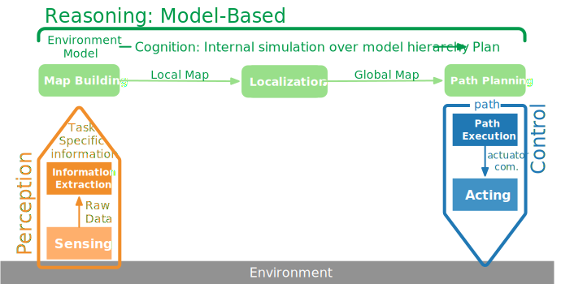
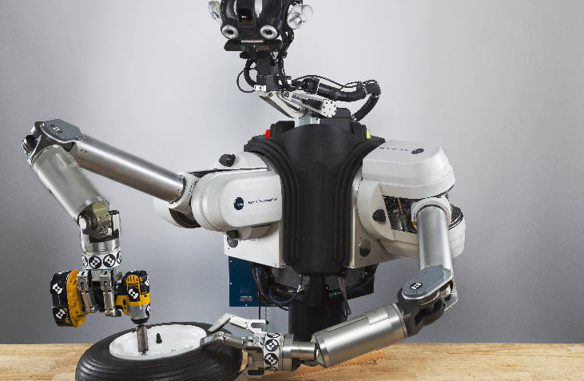
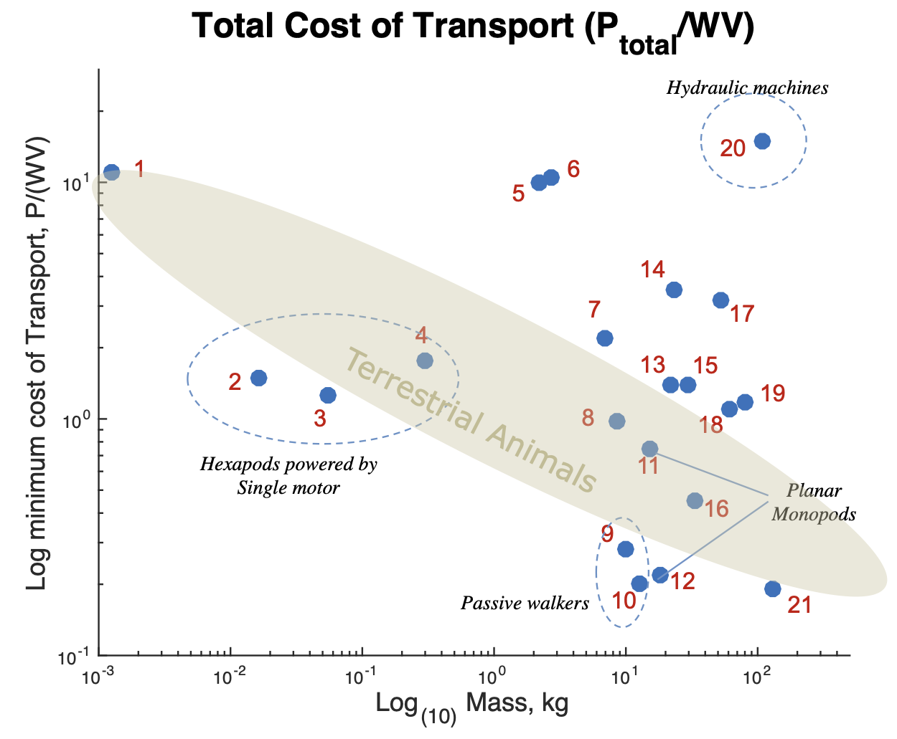
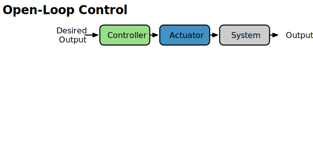
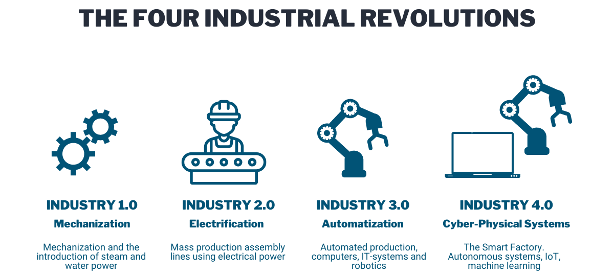
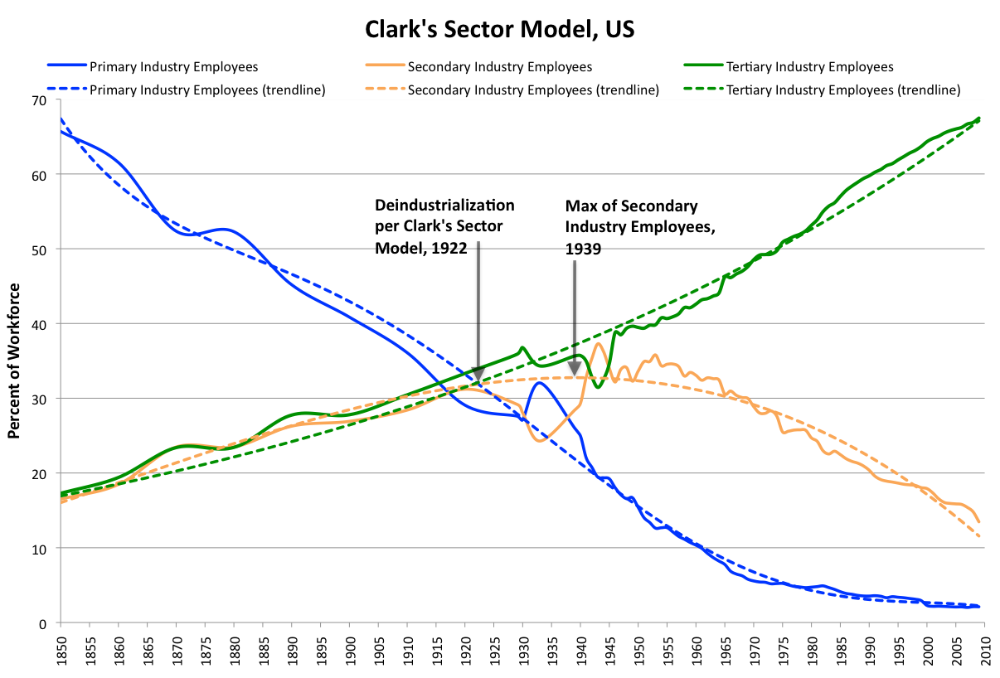
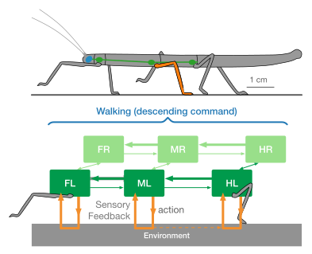

# Overview today {.columns}

## {.left}

1. Locomotion in Biology: Characteristics of control of movement
	* hierarchical
	* decentralized
2. Open-Loop Control of Walking
3. Embodiment -- Contribution of body properties
4. Decentralized control in animals and robots
5. An example of learning to walk

## {.right}

{ width=600px}

# Recap: Key Building Blocks for General-Purpose Robot Autonomy {.columns}

## Perception {.left}

What should be attended to and how to process sensory input?

* seeing and understanding 
* 3D environments

{height=240px}

## Decision Making {.right .fragment}

Which action to take, how to move around, manipulate objects, use tools? 

* planning 
* control for long-term interactions

{height=240px}

## {.bottom .footer}

[@cs391R2020]

# Recap: Key Building Blocks for General-Purpose Robot Autonomy {.columns}

## Intelligence {.left}

What are high level processes and how do they interact with lower levels?

* cognitive reasoning
* fast adaptation to new situations

{height=240px}

## Real-Word Systems {.right .fragment}

How do body and control interact?

* physical embodiment 
* hardware constraints

{height=240px}

## {.bottom .footer}

[@cs391R2020]

# Auto... ? 

::: columns-2-1

"Auto GPT, an AI application that can help you **automate** and optimize your business processes, generate test cases, debug code, and even generate new business ideas. [...] Auto GPT is one of the first examples of GPT-4 running **autonomously**, and it pushes the boundaries of what is possible with AI."

{height=320px}

:::

:::col30

{width=240px}

:::

:::col70

But what is it now: Automation or Autonomous?

What is the difference?

:::

## {.footer}

[AutoGPT](https://autogpt.net/amazing-use-cases-for-auto-gpt-on-twitter/)

# Recap -- Automation to Autonomy {.columns}

## {.top}

{height=240px}

## Automation {.left}

* repetitive tasks executed by a machine
* with minimal or no human intervention 
* which can be pre-programmed but still requires human input 

## Autonomy {.right}

> Robots are considered to be autonomous when they make decisions in response to their environment (rather than simply following a pre-programmed set of motions) **[@correll2023]**. 

## {.bottom .footer}

[@cs391R2020]

# Recap -- Degrees of Autonomy 

{width=1200px}

## {.footer}

[https://blog.netapp.com/how-to-build-a-data-pipeline-for-autonomous-driving/amp/](https://blog.netapp.com/how-to-build-a-data-pipeline-for-autonomous-driving/amp/)

# Locomotion in Robots {.section data-background-color="#6A931C"}

# Humanoid Robots - Evolution 

{width=1200px}

## {.footer}

[@humanoid2017]

# Boston Dynamics 1 - Fast overview

 Atlas.mp4){height=600px .controls .autoplay}

# Locomotion in Nature

::: incremental

* a multitude of locomotion concepts has evolved in nature
	* Adaptation to environmental characteristics
	* Adaptation to the perceived environment (e.g. size)
* Difficult to imitate technically
	* Concepts found in nature
	* Do not employ wheels
	* Sometimes imitate wheels (bipedal walking)
* Most technical systems today use wheels or caterpillars
	* Legged locomotion largely a research topic

:::

# Locomotion Mechanisms

{height=480px}

## {.footer}

[@siegwart2011]

# Characterization of locomotion concept {.columns}

## {.top}

Locomotion: 

* physical interaction between a system and its environment, 
* concernced with interaction forces, and the mechanisms and actuators that generate them

## Important issues: 

## {.left .fragment}

* stability
	* number of contact points
	* center of gravity
	* static/dynamic stabilization
	* inclination of terrain

## {.right .fragment}

* characteristics of contact: contact point or contact area, angle of contact, friction
* type of environment: structure, medium (soft/hard ground, water, air) 

# Stability {.columns}

## Statically stable {.left}

{height=240px}

* body weight supported by at least three legs
* even if all joints stop, the robot will not tumble
* safe, but slow and inefficient

## Dynamic Stability {.right .fragment}

{height=240px}

* the robot would fall if not continuously moving
* $\leq 3$ legs might be in ground contact
* fast, efficient and demanding for actuation and control

## {.footer}

[@siegwart2011]

# Efficiency of Locomotion {.columns}

## Type of locomotion {.left}

Characterized by

* number of actuators
* structural complexity
* control expense
* energy efficiency
* movement of the involved masses
	* walking/ running includes up and down movement of COG
	* some extra losses

## {.right}

{height=480px}

## {.footer}

[@todd1985walking]

# Cost of Transportation

## Cost of transport {.definition}

The ratio of power consumption to the product of weight and speed.

## 

$$
CoT = \frac{E}{m \times g \times d} = \frac{P}{m \times g \times v}
$$

$E =$ Energy (capacity to do work, measured in joules [J] or kilowatt-hours [kWh]),  
$P =$ Power (amount of energy produced per unit of time, Measured in watts [W]), $m =$ mass, $d =$ distance, $v =$ speed

# Comparison of CoT in robots 

{height=480px}

## {.footer}

[@kim2017]

# Overview robots for figure

::: columns-1-1-1

::: biped

Biped

* 6 MIT Learning Biped
* 8 RHex-biped
* 10 Cornell Biped
* 15 Fastrunner
* 17 ATRIAS 2.1 
* 18 Asimo

:::

::: quadruped

Quadruped

* 1 HAMR-VP
* 5 Cheetah Cub
* 9 Cornell Ranger
* 14 StarlETH
* 16 MIT Cheetah
* 19 KOLT
* 20 Big Dog

:::

::: hexapod

Hexapod

* 2 X2-VelociROACH
* 3 DASH
* 4 iSprawl
* 7 RHexhexapod

:::

:::

## {.footer}

[@kim2017]

# Boston Dynamics 2 - Topic-wise overview

{height=480px .controls .autoplay}

# Control View: Outer Loop {.section data-background-color="#6A931C"}

# Outer Control Loop

::: r-stack
{ width=1000px }
{ height=500px .fragment }
{ height=500px .fragment }
:::

# Outer Control Loop {.columns}

## Open-Control Loop {.left}

{ width=500px }

* Output is determined solely by input, without feedback.
* Control is based on predetermined instructions, without real-time monitoring.
* Commonly used in stable systems with predictable input-output relationships.

## Closed-Control Loop {.right .fragment}

{ width=500px }

* Control is based on system's actual performance, not just input.
* Output is continuously monitored and adjusted based on feedback.
* Commonly used in systems that require precise and accurate control or are subject to changing conditions.

# Walking -- How does the nervous system control movement? 

{height=480px .controls .autoplay}

# Walking -- How does the nervous system control movement? {.columns} 

## {.left}

{height=480px}

## {.right .fragment}

:::r-stack
{height=400px}
{height=480px .fragment}
:::

## {.footer}

[@arber_connecting_2018]

# Walking -- How does the nervous system control movement? {.columns} 

## {.left}

:::r-stack
{height=480px}
{height=480px .fragment}
:::

## {.right}

{height=480px}

## {.footer}

[@ijspeert2018] ; [@dickinson_how_2000]

# Transition from walking to swimming in the Salamander

{height=540px .controls .autoplay}

## {.footer}

[@ijspeert2007]

# Central-Pattern Generators in Salamander {.columns}

## {.left}

Salamander locomotion is to a large extent controlled by central pattern generators:

* control is mostly open-loop (i.e., without sensory feedback) 
* there is only minimal modulation from descending signals 
* two drive signals, one for each side of the spinal cord -- these modulate speed, heading, and type of gait

## {.right}

{width=600px}

## {.footer}

[@ijspeert2007]

# Central-Pattern Generators {.columns}

## Structure {.left}

{height=450px}

## Rhytmic activity in cats {.right}

{height=450px}

## {.footer}

[@Ryu:2021aa], [@pearson1976control]

# Central-Pattern Generators {.columns}

## CPGs {.definition .left}

"Central pattern generators are neural networks capable of producing coordinated patterns of rhythmic activity without any rhythmic inputs from sensory feedback or from higher control centers. ... they underlie many rhythmic behaviors both in invertebrate and vertebrate animals."

## CPG Characteristics {.right .fragment}

1. purpose: produce stable rhythmic patterns (return after perturbance),
2. well suited for distributed implementation,
3. only few control parameters 
4. can integrate sensory feedback signals as modulation
5. parameters can be learned.

## {.footer}

[@ijspeert2007]

# Walking and swimming for the Robot

{height=480px .controls .autoplay}

## {.footer}

[@ijspeert2007]

# Comparison of Movements in Salamander and Robot

{width=600px}

## {.footer}

[@ijspeert2007]

# Comparison of Movements in Salamander and Robot 2

{width=600px}

## {.footer}

[@ijspeert2007]

# Open-Loop Control in different Species {.columns}

## {.left}

* in lamprey and salamander: locomotion is to a large extent controlled by central pattern generators in an open-loop fashion
* in higher animals this can be found in fast running as well and embodied characteristics have to compensate (e.g. elasticities in leg)
* but in human locomotion or slower walking: sensory feedback is essential and drives walking

## {.right}

{height=480px}

## {.footer}

[@ijspeert2018]

# (Discussion) and Registration Break  {.section data-background-color="#FF6600"}

# Exercises will work in ROS {.columns}

## Robotic Operating System (ROS) {.theorem .left}

Consists of the Middleware, Algorithms and Developer tools.

##

* Developed in 2007 at the Stanford Artificial Intelligence Laboratory,
* Since 2013 managed by the Opens Science Robotic Foundation,
* ROS 2 has been redesigned as a new standard [@Koubaa2017].
 
## {.right}

{height=360px}

\

[{width=150px}](www.ros.org)

# ROS Core Ideas

ROS is used in many universities and companies as a standard for robot programming.

* Peer to peer System -- ROS is a middleware: Individual programs communicate using a given API (ROS messages, services, etc.).
* Distributed: Programs can run on multiple computers and communicate.
* Multi-lingual: ROS modules can be written in many common languages (C++, Python, MATLAB, Java, etc.).
* Light-weight communication: Stand-alone libraries are wrapped around with a thin ROS layer.
* Free and open-source: Most ROS software is open-source and free to use.

# ROS - provides a middleware {.columns}

## ROS Master {.left}

* Manages the communication between nodes (processes)
* Every node registers at startup with the master

<!--Start with: `> roscore`-->

## ROS Nodes {.center .fragment}

* Single-purpose, executable program
* Individually compiled, executed, and
managed
* Organized in packages

<!--Run: `> rosrun *package* *node*`  
See active nodes: `> rosnode list`
Get information on node: `> rosnode info *node_name*`-->

## {.right}

{width=420px}

## Topics {.bottom .fragment}

Nodes communicate over topics (name for message stream): can publish / subscribe.

## {.footer}

[@ros_course_2021]

# ROS Messages {.columns}

##  {.left}

* Data structure defining the type of a topic
* Comprised of a nested structure of integers,
floats, booleans, strings etc. and arrays of objects
* Defined in *.msg files

## {.right}

{height=450px}

## {.footer}

[@ros_course_2021]

# Exercises: Using an Online Learning Plattform 

::: columns-60-40

{height=420px}

* In the exercise, we will use for simulation [the ConstructSim](https://www.theconstructsim.com) learning plattform: 
	* introduction to Python 
	* and ROS, 
	* afterwards applying this on simple robotic example tasks and using common ROS libraries.
* [Register ONE](https://app.theconstructsim.com/) person per exercise group NOW -- and [send a mail](mailto:malte.schilling@uni-muenster.de) to me!
:::

# Discussion -- Automation of Human Jobs

Started with the industrial revolution (first in England): 1769 the Steam engine and followed by automatic loom.

{height=400px}

## {.bottom .footer}

Figure from https://www.calsoft.com/what-is-industry-4-0/

# "The robots are rising ..."

:::col30
{width=300}
:::

:::col70

Looking at a spectrum of jobs

- What are (in your opinion) the next breakthroughs? 
- What are implications for society?

:::

# John Oliver's getting answers ...

{height=400px .controls .autoplay}

## {.bottom .footer}

[John Oliver (2018), Last Week Tonight: Automation.](https://www.youtube.com/watch?v=_h1ooyyFkF0)

# Possible Influence of Intelligent Robots {.columns}

## {.left}

Automation has already affected the primary (production) and secondary (manufacturing) sector.

Intelligent robots may replace more jobs in the future especially in the service sector:

* Service Robots:
	* Cleaning
	* Caring
* Autonomous cars
* More flexible assembly lines
* Higher automation for non-mass product

## {.right}

{width=600px}

## {.bottom .footer}

[Clark's Sector model.png. (2020, October 31). Wikimedia Commons](https://commons.wikimedia.org/w/index.php?title=File:Clark%27s_Sector_model.png&oldid=508049811)

# Influence of LLMs as Intelligent Systems on Labor Market {.columns}

## {.left}

"[OpenAI's] findings indicate that *approximately 80% of the U.S. workforce could have at least 10% *of their work tasks affected by the introduction of GPTs, 
while *around 19% of workers may see at least 50% of their tasks* impacted. The influence spans all wage levels, with higher-income jobs potentially facing greater exposure."

## AI as a helping tool {.bottom .fragment}

"with access to an LLM, about 15% of all worker tasks in the US could be completed significantly faster at the same level of quality."

## {.right}

{width=600px}

## {.footer}

[@eloundou2023gpts]

# Embodiment -- Contribution of Body {.section data-background-color="#6A931C"}

# Recap -- The Task of a Robot

{width=1200px}

* Robots are embodied: The physical body has to be controlled.
* Robots are situated: The body is part of the environment and senses (partially) this environment.
* Goal: Is a successful interaction with the environment.

## {.bottom .footer}

[@cs391R2020]

# Exploiting Body Properties

Fast running in a cockroach is stabilized through passive properties (muscle and tissue elasticities) and fast acting preflexes.

{width=1000px}

Detailed research on embodiment and the contribution of mechanical properties in insects complements the understanding of contributions to motor control.

\

## {.footer}

[@dickinson_how_2000]

# Whegs {.columns}

## WHeel-lEGS: {.left}

Combine the advantages of wheels and legs:

* Wheels: relatively simple, and allow a vehicle to to move over terrain quickly. 
* Legs: allow robots to climb higher obstacles.

## RHex{.right}

{height=420px}

# Whegs applied on RHex 

{height=540px .controls .autoplay}

## {.footer}

Image and [video](https://www.youtube.com/watch?v=ISznqY3kESI) from [https://www.bostondynamics.com/](https://www.bostondynamics.com/).

# Example: Passive Walker

{height=480px .controls .autoplay}

They realize a configuration that ingeniously couples two physical oscillations to realize walking almost for free.

## {.footer}

[@mcgeer_passive_1990]

# Dynamic walking

{width=1000px}

Walking can be represented by an inverted pendulum.

## {.footer}

[@collins2010]

# Inverted pendulum

{width=1000px}

## {.footer}

[@collins2010]

# Dynamic walking{.columns}

## Inverted pendulum {.left}

* Static walking can be represented by inverted pendulum
* Exploit this in so-called passive dynamic walkers
* Add small actuation to walk on flat ground

## {.right}

::: columns-1-1-1

{width=160px}

{width=160px}

{width=160px}

:::

## {.footer}

[@siegwart2011]

# Passive Walker {.columns}

## Leg as a Pendulum {.left}

Passive dynamics of bipedal limbs alone are sufficient to produce a walking motion.

{height=320px}

## Store energy in springs {.right .fragment}

Energy gained by descending the slope is balanced by energy dissipated each time the swing foot hits the ground.

{height=320px}

## {.footer}

[@mcgeer_passive_1990]

# Passive Walker: Knee Joint

Allows for ground clearance without additional control 

{height=304px data-autoplay=true controls=1 start=1 loop=1}

# Summary: Passive Walker

They realize a configuration that ingeniously couples two physical oscillations to realize walking almost for free.

:::incremental

* a lateral oscillation lifts the left and the right leg in alternation from the ground 
* superimposed is the natural swing movement of a leg that behaves like a pendulum. This moves the free leg forward while the body "topples" a bit forward around the supported leg. 
* a proper coupling of both motions can produce an automatic and self-stabilizing gait along an inclined plane 
* human walking seems to be constructed around such a mechanism: instead of computing everything from scratch, a natural motion is only modulated and reshaped, saving both energy and computation. 

:::

# Passive Walker -- Exploiting the Body Structure

{height=600px data-autoplay=true controls=1 start=1}

# Embodiment

The clear cut between "computation in the brain" and "sensing/acting in the body" is only a first-order approximation: 

:::incremental

* since the sensors and actuators determine what can be measured and how things can be done, the body cannot be avoided to be part of the "representation" on which the computations in the (robot) brain have to be based. 
* different body designs can change the computational difficulty of the same task from "easy" to "almost impossible" 
* clever architectures exploit this fact (as probably did evolution) and include the body to let its physics carry out some of the computations "for free", leaving a more doable task for the brain. 

:::

# Consider Body as Part of Control Problem {.columns}

## {.left}

{width=640px data-autoplay=true controls=1 start=1}

## Classical Engineering Approach {.right}

Centralized control, explicit computation of joint movements, requires precomputation.

\

Problem: Not adaptive to slight disturbances.

<!--
# Consider Body as Part of Control Problem -- Poppy Robot

{height=480px .controls .autoplay}

Poppy -- open source robot project. FLOWERS Team (P.-Y. Oudeyer, M. Lapeyere).

## {.footer}
www.poppy-project.org
-->

# Decentralized Control {.section data-background-color="#6A931C"}

# Overview Hierarchical and Decentralized Motor Control

{height=540px}

## {.footer}

[@schilling2022cognitive]

# Coordination of Emergent Behavior {.columns}

## Decentralized Motor Control {.left}

{height=400px}

Decentralized control requires coordination of local control modules. These could be neural connections.

## {.right}

{width=640px .controls .autoplay}

## {.footer}

[@schilling_walknet_2013]

# Hierarchical and Decentralized Motor Control {.columns}

## {.left}

* 2 Phases: swing – stance = 2 Motor Primitives

* local pattern generator in each leg
	* switches between states
	* controlled by sensory inputs
	* modulates motor primitives

## {.right}

{height=540px}

## {.footer}

[@schilling_walknet_2013]

# Single Leg Controller

{height=400px}

## {.footer}

[@schilling_walknet_2013]

# Coordination inside the Walknet Controller {.columns}

## {.left}

* 2 Phases: swing – stance = 2 Motor Primitives 

* control dynamically the phase relationships between the pattern generators

* Basic rules:
	* Rule 1: Suppress lift-off
	* Rule 2: Facilitate early protraction
	* Rule 3: Enforce late protraction
	* Rule 4: Aim touch-down location

## {.right}

{height=540px}

## {.footer}

[@schilling_walknet_2013]

# Dynamic simulation of slow walking in a hexapod robot — wave gait

{height=480px .controls .autoplay}

# Dynamic simulation in a hexapod robot (high velocity) — tripod gait

{height=480px .controls .autoplay}

# Dynamic simulation in a hexapod robot – Curve Walking

{height=480px .controls .autoplay}

# Simple Adaptive Climbing on Hector

{height=480px .controls .autoplay}

## {.footer}

[@paskarbeit_obstacle_2015]

# Coordination of Emergent Behavior {.columns}

## Decentralized Motor Control {.left}

{height=360px}

Decentralized control requires coordination of local control modules. These could be neural connections.

## Physical Communication {.right .fragment}

{height=360px}

Sense unloading directly which drives switching. 
The body is replacing the explicit computation or communication.

## {.bottom .footer}

[@schilling_walknet_2013;@owaki_quadruped_2017]

# Gait Transitions mediated by Unloading

{height=480px .controls .autoplay}

## {.footer}

[@owaki_quadruped_2017]

# References{ .biblio}

