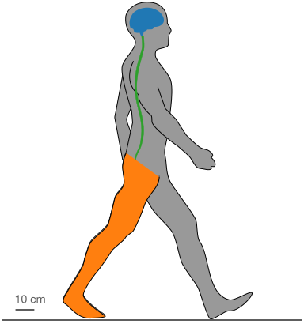
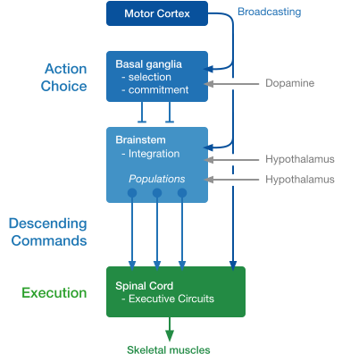
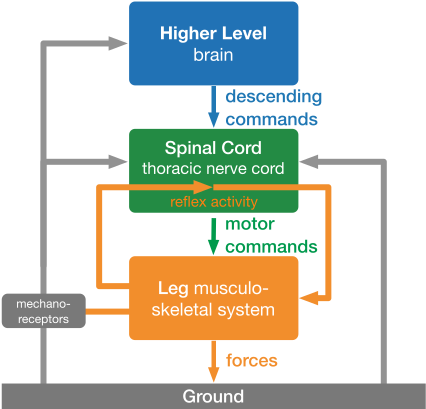
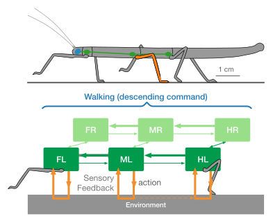

# Hierarchical Organization of Motor Control {.columns}

## Modularization in Behavior {.left}

{height=540px}

## Hierarchical Control {.right .fragment}

{height=540px class="fragment current-visible"}
{height=540px class="fragment current-visible" style="margin-top:-540px;"}

## {.bottom .footer}

[@arber_connecting_2018]

# Coordination of Emergent Behavior {.columns}

## Decentralized Motor Control {.left}

{height=400px}

Decentralized control requires coordination of local control modules. These could be neural connections.

