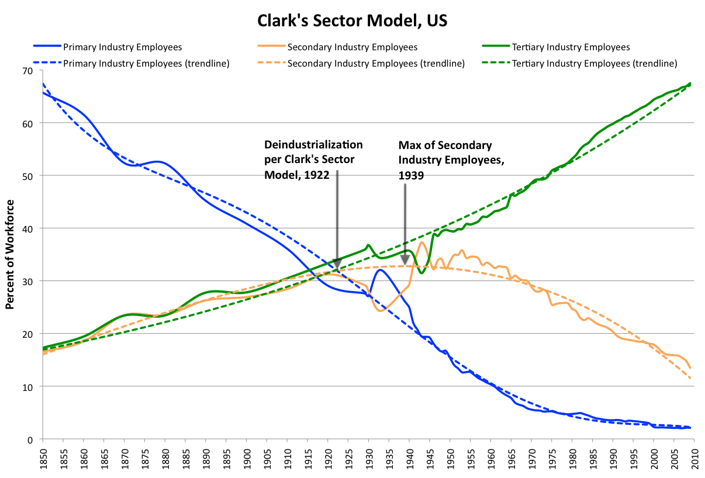

# Discussion Break  {.section data-background-color="#FF6600"}

# "The robots are rising ..."

:::col30
{width=300}
:::

:::col70
Looking at the spectrum of intelligence 

- What are (in your opinion) the next breakthroughs? 
- What are implications for society?

:::

# John Oliver's getting answers ...

{height=400px .controls .autoplay}

## {.bottom .footer}

[John Oliver (2018), Last Week Tonight: Automation.](https://www.youtube.com/watch?v=_h1ooyyFkF0)

# Possible Influence of Intelligent Robots {.columns}

## {.left}

Automation has already affected the primary (production) and secondary (manufacturing) sector.

Intelligent robots may replace more jobs in the future especially in the service sector:

* Service Robots:
	* Cleaning
	* Caring
* Autonomous cars
* More flexible assembly lines
* Higher automation for non mass product

## {.right}

{width=600px}

## {.bottom .footer}

[Clark's Sector model.png. (2020, October 31). Wikimedia Commons](https://commons.wikimedia.org/w/index.php?title=File:Clark%27s_Sector_model.png&oldid=508049811)
