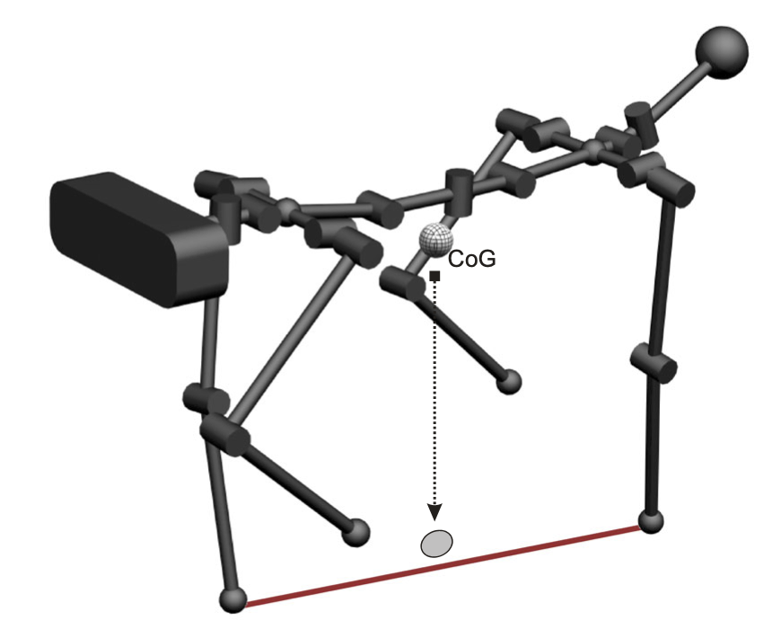
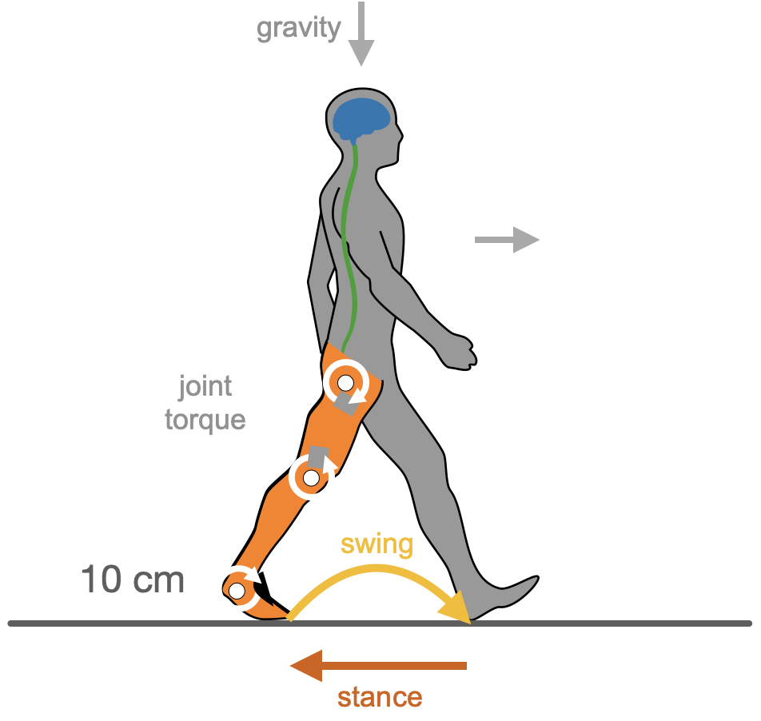
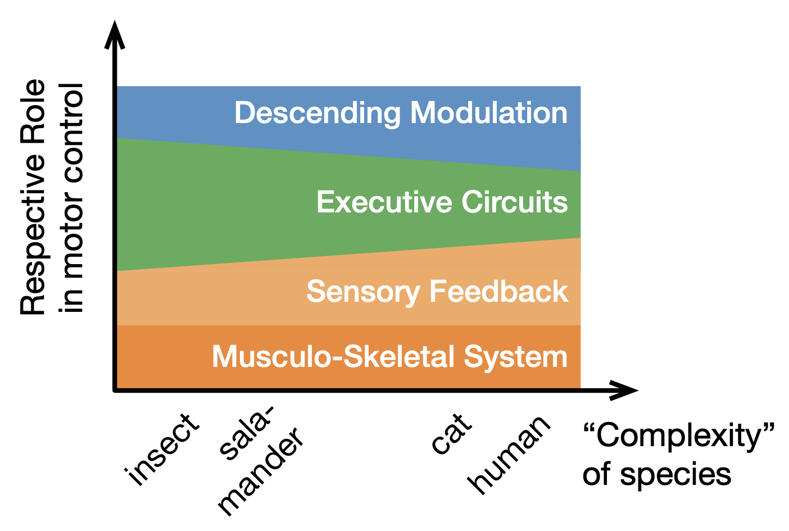
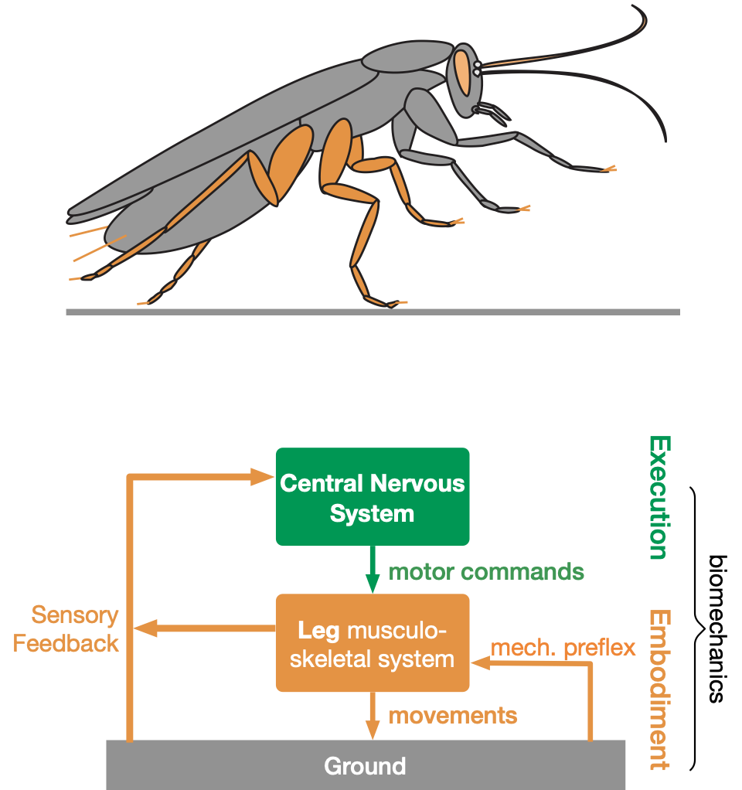
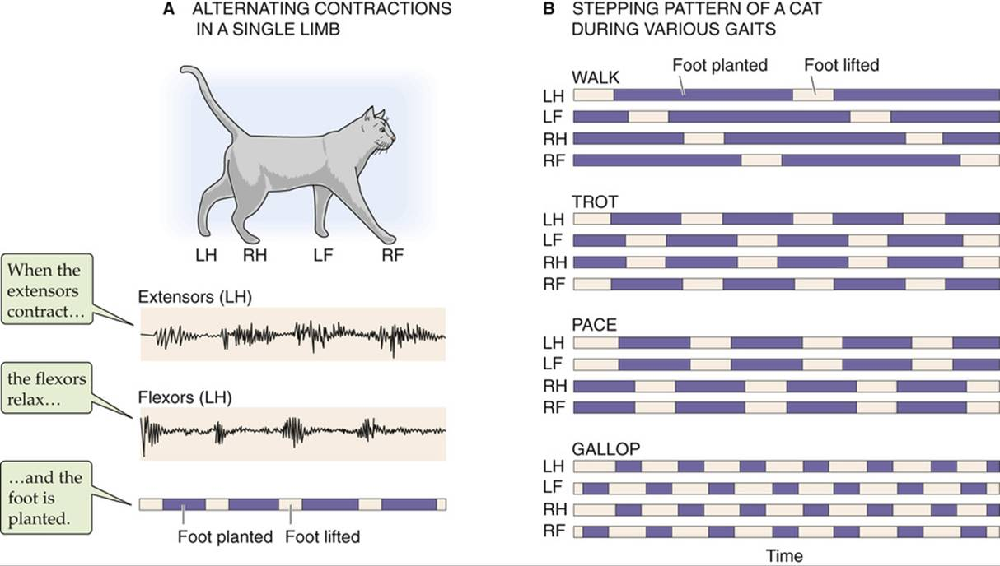
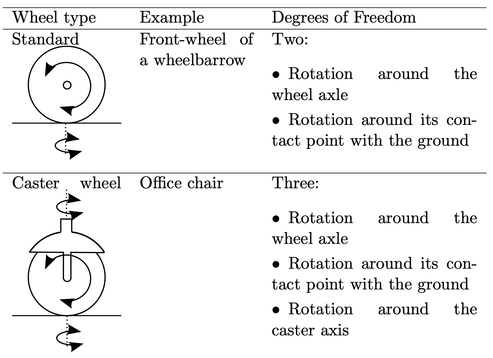
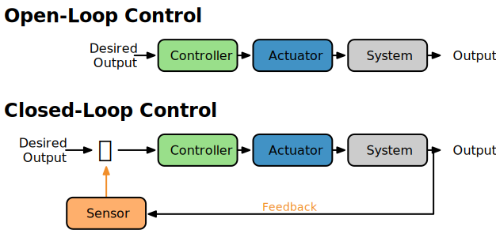
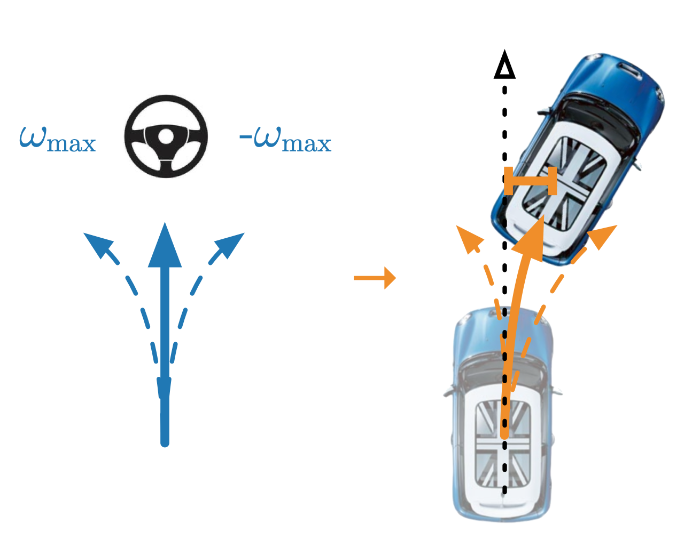
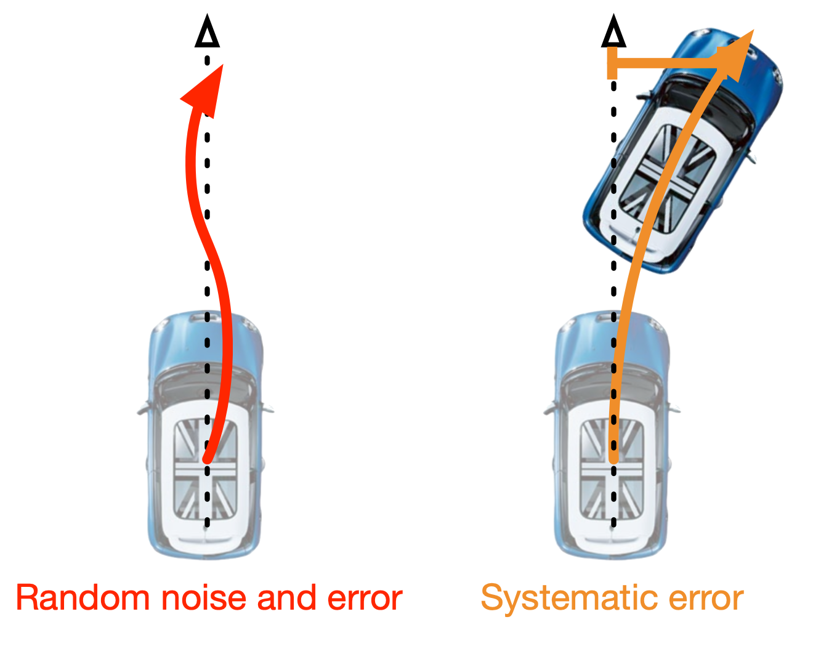

# Overview today

* Frames of Reference
* Transformation between different coordinate systems
* PID Control

# Recap: Stability {.columns}

## Statically stable {.left}

{height=240px}

* body weight supported by at least three legs
* even if all joints stop, the robot will not tumble
* safe, but slow and inefficient

## Dynamic Stability {.right}

{height=240px}

* the robot would fall if not continuously moving
* $\leq 3$ legs might be in ground contact
* fast, efficient and demanding for actuation and control

## {.footer}

[@siegwart2011]

# Recap: Control of Walking {.columns} 

## {.left}

:::r-stack
{height=480px}
{height=480px .fragment}
:::

## {.right}

{height=480px}

## {.footer}

[@ijspeert2018] ; [@dickinson_how_2000]

# Recap: Central-Pattern Generators {.columns}

## Structure {.left}

{height=450px}

## Rhytmic activity in cats {.right}

{height=450px}

## {.footer}

[@Ryu:2021aa], [@pearson1976control]

# Towards Efficient Dynamic Walking: Optimizing Gaits {.columns}

## {.top}

* Nature optimizes gaits
* Storage of “elastic” energy 
* Allow locomotion at varying speeds: different gaits utilize these elements differently
* The energetically most economic gait is a function of desired speed.

## {.left}

{height=260px}

## {.right}

{height=260px}

## {.footer}

[@siegwart2011], [@minetti2002energy]

# Fixed or free gaits {.columns}

## Observation in Animals {.left}

*"Although some studies report distinct gaits in insects [...], many note a high degree of variability in limb coordination, with intermediate patterns intermixed with movements that resemble canonical gaits. [...] Drosophila use a single continuum of coordination patterns without evidence for preferred configurations. "* [@deangelis_manifold_2019]

## Effect on fixed gait patterns on robots {.right .fragment}

*"Conventional methods plan gaits and footholds separately and treat them as a single-step optimal process. However, such approaches cause poor passability in sparse foothold environments."* [@xu2021contact]

*"fixing a set of pre-programmed gaits limits the generality of locomotion."*[@fu2021minimizing]

## {.bottom .fragment}

*"studies of motor control in animals and human infants have shown that general locomotion in natural settings is irregular and does not fit predefined fixed gaits."* [@fu2021minimizing]

# Research: Minimizing Energy Consumption Leads to the Emergence of Gaits in Legged Robots {.columns}

## Deep Reinforcement Learning {.left}

**Reward**: minimize mechanical energy 

* emergence of natural locomotion gaits at different speeds
	* structured in ideal terrains (as in animals)
	* unstructured gaits in rough terrains

## {.center}

{height=500px}

## {.right}

{height=500px}

## {.footer}

[@fu2021minimizing], see [github page](https://energy-locomotion.github.io)

# Research: Minimizing Energy Consumption Leads to the Emergence of Gaits in Legged Robots 

{height=480px .controls .autoplay}

## {.footer}

[@fu2021minimizing], see [github page](https://energy-locomotion.github.io)

#  {#res-minimize-energy data-menu-title="Minimizing Energy Consumption"}

{width=1280px height=640px .print .iframe}

# Recap: Hierarchical and Decentralized Motor Control

{height=540px}

## {.footer}

[@schilling2022cognitive]

# Recap: Coordination of Emergent Behavior {.columns}

## Decentralized Motor Control {.left}

{height=400px}

Decentralized control requires coordination of local control modules. These could be neural connections.

## {.footer}

[@schilling_walknet_2013]

# Forms of Locomotion {.section data-background-color="#6A931C"}

<!--# TODO

Siegwart slide on legs -->

# Flying Robots{.columns}

## {.left}

{height=480px}

## {.right}

{height=480px}

## {.footer}

[@siegwart2011]

# Example -- Quadrocopter ball juggling

{height=480px .controls .autoplay}

## {.footer}

[@mulIROS11]

# Example -- Quadrocopter ball juggling {.columns}

## Control scheme {.left}

* generate open-loop trajectory to steer towards predicted impact point,
* prediction ball: integrate position and velocity estimates from a Kalman filter,
* Adapt: use ball and vehicle trajectories before and after impact &rarr; estimate
	* ball’s drag coefficient, 
	* the racket’s coefficient of restitution 
	* and an aiming bias.

## {.right}

{height=480px}

## {.footer}

[@mulIROS11]

# Omnicopter {.columns}

## Disadvantages of Quadrocopter {.left}

* all rotor disks are aligned in a single plane
* translational and rotational dynamics are coupled
* multi-rotor vehicles are under-actuated: they can't independently control their thrust and torque in all three dimensions
* this limits their movement and possible trajectories 

## {.right}

{width=600px .controls .autoplay}

## {.footer}

[@brescianini2018omnicopter]

# Freiheitsgrade: Degrees-of-Freedom {.columns}

## Degee of Freedom {.top .definition}

A ‘Degree of Freedom’ (DoF) in an independent joint provides freedom of movement for the manipulator, either in a rotational or translational/linear sense. Every geometric axis that a joint can rotate around or extend along is counted as one DoF. 

## (Active) degree of freedom {.left}

... refers to the number of movements - translational and rotational - that a joint or a robot component can perform. This depends on the type of joint. The number of DoFs of a robot is equal to the sum of the Dof of the individual components.

## Effective degree of freedom {.right} 

...refers to the dimensionality of the pose (position and orientation) that the system can assume. This would be 3 positional DoFs and 3 orientational in 3D, but in 2D there is only one orientational.

## {.footer}

[@hertzberg2012mobile]

# Dealing with rough terrain{.columns}

## {.left}

Legged systems can overcome many obstacles, that are not reachable by
wheeled systems!

But it is quite hard to achieve this since

* many DOFs must be controlled in a
* the robot must see detailed elements of the coordinated way
terrain

## {.right}

{height=480px}

## {.footer}

[@siegwart2011]

# Wheeled robots

{height=480px}

## {.footer}

[@siegwart2011]

# Wheeled robots 2

{height=480px}

## {.footer}

[@siegwart2011]

# Frame of References and Transformations {.section data-background-color="#6A931C"}

# Global Frame of Reference {.columns}

## {.left}

Describe position and orientation in a global reference frame:

$$
\xi_I = \mathbf{q} =
\begin{bmatrix} x \\ y \\ \theta \end{bmatrix}
$$

[:vspace](40px)

There are 2 positional and 1 orientational degree of freedom.

## {.right}

[:include](src/reference_driving.md)

# Recap: Outer Control Loop

{ height=500px}

# Control in the car example {.columns}

## {.left}

Control velocity and turning

[:vspace](40px)

$$
\mathbf{u} = 
\begin{bmatrix} v \\ \varphi \ \end{bmatrix}
$$

$\varphi$ describes the angle of the two steerable front wheels.

## {.right}

[:include](src/reference_control.md)

# Holonomic Systems {.columns}

## Holonomic Constraint {.left .definition}

Equality constraints directly on the state of the system, but not applied to  higher-order derivatives:

$$
\mathbf{f}(\mathbf{x}, t) = 0
$$

## Example {.right}

If you want to constraint the state to lie on a circle -- as when dealing with a robotic arm. This simply depends on the current posture, but not on past movements.

# Non-Holonomic System {.columns}

## Non-holonomic Constraints {.left .definition}

Equality constraints that involve the derivatives of the state (e.g. velocity) in a way that it cannot be integrated out into holonomic constraints, i.e.

$$
\mathbf{f}(\mathbf{x}, \mathbf{\dot{x}}, t) = 0
$$

but not $\mathbf{f}(\mathbf{x}, t) = 0$.

## Non-holonomic Systems {.right }

We define a nonholonomic system as one with differential
constraints 

&rarr; Not all degrees of freedom are directly controllable.

$$
\text{Non-holomonic} \Leftrightarrow dim(\mathbf{u}) < dim(\mathbf{x})
$$

# Car example is non-holonomic {.columns}

## {.left}

$$
\textbf{State } \mathbf{q} =
\begin{bmatrix} x \\ y \\ \theta \end{bmatrix}, 
\textbf{Control }\mathbf{u} = 
\begin{bmatrix} v \\ \varphi \ \end{bmatrix}$$

## System equation:

$$
\begin{bmatrix} \dot{x} \\ \dot{y} \\ \dot{\theta} \end{bmatrix} = 
\begin{bmatrix} v \cos \theta \\ v \sin \theta \\ (v/L) \tan \varphi \ \end{bmatrix}$$

$L$ is length of car, last entry describes the change of orientation depending on steering angle.

## {.right}

[:include](src/reference_control.md)

# Car example is non-holonomic

The car is a non-holonomic system -- not all DoFs are controllable.

$$ dim(u) < dim(q) $$

We have the differential constraint $\dot{q}$:
$$
\dot{x} \sin \theta − \dot{y} \cos \theta = 0
$$

Which means: *"A car cannot move directly lateral."*

This describes dynamical systems as non-holonomic in general: Just like a car cannot instantly move sidewards, a dynamic system cannot instantly change its state $q$: the current change in position is constrained by the current velocity.

## {.footer}

[@toussaint2014]

# Task: Sequence of Actions {.section data-background-color="#FF6600"}

# Drive the simplified car {.columns}

## {.top}

:::col30
{width=300px}
:::

:::col70

Your task is to drive the car (simplified: we can turn on the spot). 

Initial state is $\mathbf{q} =
\begin{bmatrix} 0 \\ 0 \\ 0^\circ \end{bmatrix}$ (facing in direction of x-axis). 

Drive the following sequences and compare the results:

:::

## Sequence A {.left}

* drive forward $2$ units,
* turn left by $45^\circ$,
* drive forward $1$ unit.

## Sequence B {.right}

* drive forward $1$ units,
* turn left by $45^\circ$,
* drive forward $2$ unit.

# Example: Two different orders of sequences{.columns}

## Sequence A {.left}

Drive forward $2$ units 

&rarr; turn left by $45^\circ$ 

&rarr; drive forward $1$ unit.

::: r-stack
{ width=500px }
{ width=500px .fragment}
{ width=500px .fragment}
{ width=500px .fragment}
:::

## Sequence B {.right}

Drive forward $1$ units 

&rarr; turn left by $45^\circ$ 

&rarr; drive forward $2$ unit.

::: r-stack
{ width=500px }
{ width=500px .fragment}
{ width=500px .fragment}
{ width=500px .fragment}
:::

# Sequences of Applying actions {.columns}

## {.left}

When driving such a non-holonomic system, 

* the order of the different controls applied is important, 
* and the dependence of time.

These can be considered as transformations and one influences the following ones.

## {.right}

{height=500px}

## {.footer}

[@siegwart2011]

# Homogeneous Coordinates

... are commonly used in computer graphics and robotics

Homogeneous coordinates for a point in 2D are typically represented as a 3-dimensional vector:

$$\mathbf{p} = 
\begin{bmatrix} x \\ y \\ w \end{bmatrix},
$$

where $x$ and $y$ are the Cartesian coordinates of the point, and $w$ is a scaling factor.

Transformations can be easily applied to these as a (sequence of) matrix multiplication(s).

# Homogeneous Coordinates {.columns}

## {.left}

When we describe position and orientation in homogeneous coordinates:

[:vspace](30px)

$$ 
\mathbf{q} = \begin{bmatrix} \cos(\theta) & -\sin(\theta) & p_x \\ \sin(\theta) & \cos(\theta) & p_y \\ 0 & 0 & 1 \end{bmatrix}
$$

[:vspace](50px)

There are 2 positional and 1 orientational degree of freedom.

## {.right}

[:include](src/reference_driving.md)

# Translation

## Translation {.definition}

Transformation that shifts an object in a particular direction by a given distance. 

##

In homogeneous coordinates for , translation can be represented as a matrix multiplication:

$$
T = \begin{bmatrix} 1 & 0 & dx \\ 0 & 1 & dy \\ 0 & 0 & 1 \end{bmatrix}
$$

where $dx$ and $dy$ are the amounts of translation in the x-axis and y-axis of the outgoing frame of reference respectively.

# Scaling

Scaling is a transformation (used in Computer Graphics) that changes the size of an object along each axis by a certain scale factor. 

In homogeneous coordinates, scaling can be represented as:

$$ 
S = \begin{bmatrix} sx & 0 & 0 \\ 0 & sy & 0 \\ 0 & 0 & 1 \end{bmatrix}
$$

where $sx$ and $sy$ are the scale factors along the x-axis and y-axis respectively.

# Rotation

## Rotation {.definition}

A transformation that rotates an object about the origin (!) by a certain angle. 

## 

In homogeneous coordinates for 2D:

$$ 
R = \begin{bmatrix} \cos(\theta) & -\sin(\theta) & 0 \\ \sin(\theta) & \cos(\theta) & 0 \\ 0 & 0 & 1 \end{bmatrix}
$$

where $\theta$ is the angle of rotation.

# Example: Sequence A of Transformations

Drive forward $2$ units - turn left by $45^\circ$ - drive forward $1$ unit

$$ 
\begin{eqnarray*}
\mathbf{p}_{after} &=& \begin{bmatrix} 1 & 0 & 0 \\ 0 & 1 & 0 \\ 0 & 0 & 1 \end{bmatrix} \times \begin{bmatrix} 1 & 0 & \mathit{2} \\ 0 & 1 & 0 \\ 0 & 0 & 1 \end{bmatrix} \times \begin{bmatrix} \cos(45^\circ) & -\sin(45^\circ) & 0 \\ \sin(45^\circ) & \cos(45^\circ) & 0 \\ 0 & 0 & 1 \end{bmatrix} \times \begin{bmatrix} 1 & 0 & \mathit{1} \\ 0 & 1 & 0 \\ 0 & 0 & 1 \end{bmatrix} \\
&=& \fragment{\begin{bmatrix} \cos(45^\circ) & -\sin(45^\circ) & 2 \\ \sin(45^\circ) & \cos(45^\circ) & 0 \\ 0 & 0 & 1 \end{bmatrix} \times \begin{bmatrix} 1 & 0 & \mathit{1} \\ 0 & 1 & 0 \\ 0 & 0 & 1 \end{bmatrix}} \\
&=&\fragment{\begin{bmatrix} \cos(45^\circ) & -\sin(45^\circ) & 2 + \cos(45^\circ) \\ \sin(45^\circ) & \cos(45^\circ) & \sin(45^\circ) \\ 0 & 0 & 1 \end{bmatrix}} \fragment{= \begin{bmatrix} \cos(45^\circ) & -\sin(45^\circ) & 2.707 \\ \sin(45^\circ) & \cos(45^\circ) & 0.707 \\ 0 & 0 & 1 \end{bmatrix}}
\end{eqnarray*}
$$

# Example: Sequence B of Transformations

Drive forward $1$ units - turn left by $45^\circ$ - drive forward $2$ unit

$$ 
\begin{eqnarray*}
\mathbf{p}_{after} &=& \begin{bmatrix} 1 & 0 & 0 \\ 0 & 1 & 0 \\ 0 & 0 & 1 \end{bmatrix} \times \begin{bmatrix} 1 & 0 & \mathit{1} \\ 0 & 1 & 0 \\ 0 & 0 & 1 \end{bmatrix} \times \begin{bmatrix} \cos(45^\circ) & -\sin(45^\circ) & 0 \\ \sin(45^\circ) & \cos(45^\circ) & 0 \\ 0 & 0 & 1 \end{bmatrix} \times \begin{bmatrix} 1 & 0 & \mathit{2} \\ 0 & 1 & 0 \\ 0 & 0 & 1 \end{bmatrix} \\
&=& \fragment{\begin{bmatrix} \cos(45^\circ) & -\sin(45^\circ) & 1 \\ \sin(45^\circ) & \cos(45^\circ) & 0 \\ 0 & 0 & 1 \end{bmatrix} \times \begin{bmatrix} 1 & 0 & \mathit{2} \\ 0 & 1 & 0 \\ 0 & 0 & 1 \end{bmatrix}} \\
&=&\fragment{\begin{bmatrix} \cos(45^\circ) & -\sin(45^\circ) & 1 + 2 \cos(45^\circ) \\ \sin(45^\circ) & \cos(45^\circ) & 2 \sin(45^\circ) \\ 0 & 0 & 1 \end{bmatrix}} \fragment{= \begin{bmatrix} \cos(45^\circ) & -\sin(45^\circ) & 2.414 \\ \sin(45^\circ) & \cos(45^\circ) & 1.414 \\ 0 & 0 & 1 \end{bmatrix}}
\end{eqnarray*}
$$

# Example: Two different orders of sequences{.columns}

## Sequence A {.left}

Drive forward $2$ units &rarr; turn left by $45^\circ$ &rarr; drive forward $1$ unit.

$$
\begin{bmatrix} \cos(45^\circ) & -\sin(45^\circ) & 2.707 \\ \sin(45^\circ) & \cos(45^\circ) & 0.707 \\ 0 & 0 & 1 \end{bmatrix}
$$

::: r-stack
{ width=500px }
{ width=500px .fragment}
{ width=500px .fragment}
{ width=500px .fragment}
:::

## Sequence B {.right}

Drive forward $1$ units &rarr; turn left by $45^\circ$ &rarr; drive forward $2$ unit.

$$
\begin{bmatrix} \cos(45^\circ) & -\sin(45^\circ) & 2.414 \\ \sin(45^\circ) & \cos(45^\circ) & 1.414 \\ 0 & 0 & 1 \end{bmatrix}
$$

::: r-stack
{ width=500px }
{ width=500px .fragment}
{ width=500px .fragment}
{ width=500px .fragment}
:::

# Right-hand Multiplication

* The order of applying transformations is important -- transformations are not commutative.
* In 2D we apply multiplication on the right side.
* Consequence: We change the frame of reference and apply the subsequent transformation in the new coordinate system.

## In contrast: Applying transformation in original frame of reference

Apply multiplication of transformation to the left side (more next week)!

# Change of Reference Frame {.columns}

## Driving the robot car {.left}

The movement is always described wrt. the car - we drive forward, turn, and more forward:

$$
\mathbf{q}_{new} = \mathbf{q} \times T_{dx=2} \times R_{45^\circ} \times  T_{dx=1}
$$

## Applying external movement {.right}

When describing the movement in the original (outgoing) frame of reference, we apply the transformation as a multiplication on the left!

Consider our [robot moves and rotates]{style="color: blue;"}, but then we tell [someone to pick it up and carry it $1$ unit 'North']{style="color: red;"}:

$$
\mathbf{q}_{new} = \color{red}T_{dy=1} \times \color{black} (\mathbf{q} \color{blue} \times T_{dx=2} \times R_{45^\circ})
$$

# Reference Frame and Transformations {.columns}

## {.left}

A transformation is describing a change of reference frame. This is often indicated in naming conventions of the transformation:

$$
T_I^3 = Tr_{dx=2} \times Rot_{45^\circ} \times  Tr_{dx=1}
$$

{ width=400px}

## {.right .fragment}

For the example: [robot moves and rotates]{style="color: blue;"}, but then it is [picked up and carried in the original frame reference $1$ unit 'North']{style="color: red;"}. 

We see that left multiplication is directly and only affecting the translational part:

$$
\color{red}Tr_{dy=1} \times \color{black} (\mathbf{q} \color{blue} \times Tr_{dx=2} \times Rot_{45^\circ}) = 
$$

$$
\color{red}\begin{bmatrix} 1 & 0 & 0 \\ 0 & 1 & \mathit{1} \\ 0 & 0 & 1 \end{bmatrix} \color{black} \times \begin{bmatrix} 1 & 0 & 0 \\ 0 & 1 & 0 \\ 0 & 0 & 1 \end{bmatrix} \color{blue} \times \begin{bmatrix} 1 & 0 & \mathit{2} \\ 0 & 1 & 0 \\ 0 & 0 & 1 \end{bmatrix} \times \begin{bmatrix} \cos(45^\circ) & -\sin(45^\circ) & 0 \\ \sin(45^\circ) & \cos(45^\circ) & 0 \\ 0 & 0 & 1 \end{bmatrix}
$$

# Recap: Outer Control Loop

{ height=500px}

# Example: Wall following / Staying in lane at fixed speed {.columns}

## {.left}

**Goal**: 

* Keep robot at a given distance to a wall
* Stay with an autonomous car in a lane

**Control**:

* velocity is fixed / given
* only can control heading in range of $[-\omega_{max}, \omega_{max}]$

**Sense**: cross-track error $e(t)$

## {.right}

:::r-stack
{height=480px}
{height=480px .fragment}
:::

## {.bottom .footer}

Following an example from [@csc477]

# Approach 1: Bang-bang control{.columns}

## Control{.left}

Depends on error -- go all-in.

[:vspace](30px)

$$
\omega = \begin{cases}
\omega_{\max} & \text{if } e(t) > 0 \\
-\omega_{\max} & \text{if } e(t) < 0 \\
0 & \text{if } e(t) = 0
\end{cases}
$$

[:vspace](30px)

## Possible Drawbacks?{.fragment}

What is the problem with this approach?

## {.right}

{height=480px}

# Interactive Task Wall following 1 {.section data-background-color="#FF6600"}

# Task: Wall following -- test own idea {.columns}

## {.top}

:::col30
{width=300px}
:::

:::col70

What is a problem with a bang-bang control approach? 

Do you have an intuitive idea on how to improve the control approach on this?

:::

Next, there is an interactive jupyter notebook that allows you to implement your own simple control approach. 

* Come up with an idea for a better control approach!
* How can you improve control instead of always steer as much as possible?
* What are your observations for your approach?

# JupyterLite Small Robot Car Demo 

{ .iframe width=1200px height=540px }

# Hinweis: Jupyter-Notebook

Über diesen Link kann dann direkt auf dem Hub eine Umgebung gestartet werden, in der python interaktiv interpretiert wird:

[JupyterHub Link](https://jupyterhub.wwu.de/hub/user-redirect/git-pull?repo=https%3A%2F%2Fzivgitlab.uni-muenster.de%2Fschillma%2Fexc_arob&urlpath=lab%2Ftree%2Fexc_arob%2F&branch=main) 

Dort unter 3_robot_car das `pid_robot_car.ipynb` öffnen und darin die `control_function` implementieren.

<!--# JupyterLite Demo

{ .iframe width=1200px height=540px }
-->
<!--# JupyterLite 1

{ .iframe width=1000px height=500px }
-->
# Approach: Proportional (P-) control {.columns}

## Control{.left}

Control is proportional to error

$$
\omega = K_p e(t)
$$

## Possible Drawbacks?

:::r-stack

::: {class="fragment current-visible"}

* Will the car reach the target line?
* Will the car overshoot the line?
* Asymptotic/steady-state error &rarr; $0$?

:::

:::fragment

:::: check-cross

* [X] Will the car reach the target line?
* [X] Will the car overshoot the line?
* [ ] Asymptotic/steady-state error &rarr; $0$?

::::

:::

:::

## {.right}

:::r-stack
{height=480px}
{height=480px .fragment}
{height=480px .fragment}
:::

# Addressing the oscillation problem {.columns}

## {.left}

:::incremental

* Need to reduce turning rate well before the line is approached
* Idea: 
  1. have a small proportional gain   **Problem:** that means the car doesn’t turn very much
  2. need to predict the error in the near future   This is good, as long as the oscillation is not at a high frequency

:::

## {.right}

{height=480px}

## {.bottom .footer}

[@csc477]

# Approach: Proportional-Derivative (PD-) control {.columns}

## Control{.left}

Control proportional to error and change of error -- adjust less when already turned
$$
\omega = K_p e(t) + K_d \dot{e}(t)
$$

## Problems / Questions {.fragment}

* How do we set the gains?
* What if the error estimate is noisy?
* Systematic errors/ biases

## {.right}

:::r-stack
{height=480px}
{height=480px .fragment}
:::

# What is Bias and Variance?

{height=480px}

## {.footer }

[@fortmannroe2012]

# Effect of Systematic Error on Control {.columns}

## {.top}

Real world systems often experience a systematic error (or called bias).

## Effect depends on control {.left}

* open-loop control:   dead-reckoning = no correction for (not recognized) systematic error
* closed-loop control:   can deal with this error

## {.right}

{ width=600px}

# Feedback control dealing with systematic bias {.columns}

## {.left}

Real world systems often experience bias

::: incremental

* actuation side, e.g.
  * misaligned wheels,
  * distribution of weight
* sensor side, e.g.
  * not calibrated sensor,
  * slightly different characteristics

:::

## {.right}

{height=480px}

# Feedback control dealing with systematic bias {.columns}

## Approach: Integral Control{.left}

Integrate error over time -- other errors (noise, small random perturbations) are expected to cancel each other out over time. Only systematic error is accumulating.

$$
\int_{\tau=0}^{\tau=t} e(t) dt
$$

## {.right}

{height=480px}

# Potential problem: integrator windup

What happens if the control variable reaches the actuator’s limits? 

* This means the car can’t turn as fast as the controller commands it.
* Actuator may remain at limit for a long time while controller modifies its commands.
* Error increases, integral term winds up while controller goes back to issuing commands in the feasible region.

## Heuristic fixes:

* Limit integral error values
* Stop integral error while the commands are in the non feasible region
* Reduce gain of integral error term

## {.footer}

[@csc477]

# PID Controller Equation

Integrating all three parts -- widely used in industry and robotics.

$$
\omega(t) = K_p e(t) + K_i \int_{\tau=0}^{\tau=t} e(\tau) d\tau + K_d \dot{e}(t)
$$

Also written as:
$$
\omega(t) = K_p \left[ e(t) + T_d \dot{e}(t) + \frac{1}{T_i} \int_{\tau=0}^{\tau=t} e(\tau) d\tau \right]
$$

## {.footer}

[@csc477]

# Tips for Implementation of PID controller

* Consider time as discrete
* Setup an error function: $e(t) = s_{current}(t) - s_{target}(t)$
* Observe the sensed state signal: Is this reliable?
  * If it is very noisy you might want to smooth the signal, e.g. using a moving average or a low-pass filter
* Limit the computed controls
* Limit or stop the integral term when detecting large errors and windup

# Tips for Implementation of PID controller

When working with discrete time

* Approximate the integral of the error as a sum: $$\sum_{\tau=0}^{\tau=t} e(\tau)$$
* Approximate the derivative of the error as $$\dot{e}(t) \approx \frac{e(t_k) - e(t_{k-1})}{\delta t}$$

## {.footer}

[@csc477]

# How to tune a PID controller - Manually 

* Start with the proportional term ($K_i, K_d = 0$).
  * if too small, error will not be countered
  * increase until appropriate response
* when seeing overshooting and oscillations: Introduce a derivative term
* finally, you may want to add a small integral gain (is there a bias?)

For an heuristic approach see Thrun's online course introducing a self-tuning PID controller [@thrunUdacity].

# Interactive Task Wall following 2 {.section data-background-color="#FF6600"}

# Task: Wall following -- P(I)D Control {.columns}

## {.top}

:::col30
{width=300px}
:::

:::col70

For the control of the simple car: Implement a PID controller and try to tune the parameters.

:::

Implement the PID controller in the interactive jupyter notebook.

* Start with the proportional term ($K_i, K_d = 0$).
* when seeing overshooting and oscillations: introduce a derivative term
* When would you introduce an integral part into the controller?
* What are your observations for this approach?

# JupyterLite Small Robot Car Demo 

{ .iframe width=1200px height=540px }

# Hinweis: Jupyter-Notebook

Über diesen Link kann dann direkt auf dem Hub eine Umgebung gestartet werden, in der python interaktiv interpretiert wird:

[JupyterHub Link](https://jupyterhub.wwu.de/hub/user-redirect/git-pull?repo=https%3A%2F%2Fzivgitlab.uni-muenster.de%2Fschillma%2Fexc_arob&urlpath=lab%2Ftree%2Fexc_arob%2F&branch=main) 

Dort unter 3_robot_car das `pid_robot_car.ipynb` öffnen und darin die `control_function` implementieren.

# When is PID insufficient? 

* Systems with large time delays
* Controllers that require completion time guarantees, e.g. the system must reach target state within 2 secs
* Systems with high-frequency oscillations
* High-frequency variations on the target state

## {.footer}

[@csc477]

# References{ .biblio}

