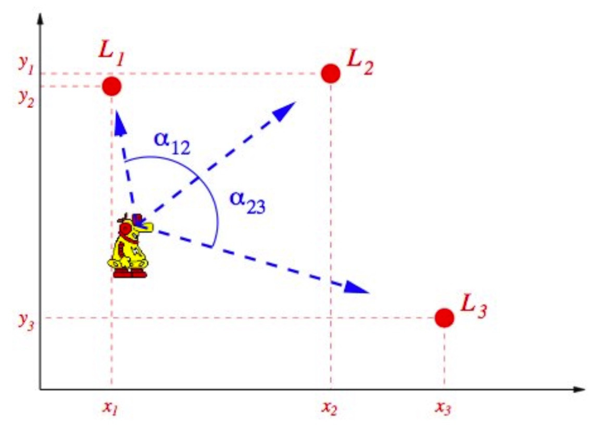
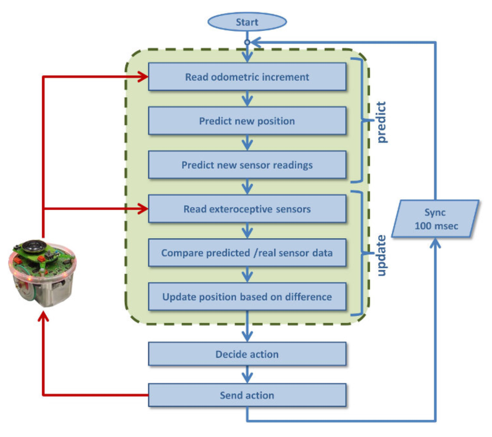

# Position Estimation Problem

Robot must keep track of its position in the map

* in order to plan a trajectory to the goal
* in order to follow the planned trajectory

## The Position Estimation Problem {.definition}

Establish the current position of the robot in the environment by using both proprioceptive (local information) and exteroceptive sensors (global information, e.g., relation to landmarks).

## {.footer}

[@vernon_course]

# Absolute Position Estimation {.columns}

## {.left}

Localize the robot from its relation to (known) landmarks.

\

Could be realized through triangulation in a known environment:

* absolute position of three points are known
* robot observes the relative angles between them
* infer absolute position in a map from this

## {.right}

{width=540px}

## {.bottom .footer}

[@vernon_course]

# Position Estimation Problem {.columns}

## Absolute position estimation (localization) {.left}

* match observed features with prior knowledge (map)
* requires: good perception, good map

## Relative position estimation (position tracking) {.right}

* update previous position by measuring displacement 
* drifts over time

## Combination{.bottom}

* absolute localization when possible
* continuous position tracking for in between updates

## {.footer}

[@vernon_course]

# Position Estimation Problem {.columns}

## Combined Localization {.left}

* absolute localization when possible
* continuous position tracking for in between updates

\

In general: recursive estimation

* use odometry to predict new position 
* use additional sensors to correct the prediction

## {.right}

{height=540px}

## {.bottom .footer}

[@vernon_course]