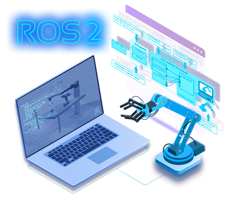
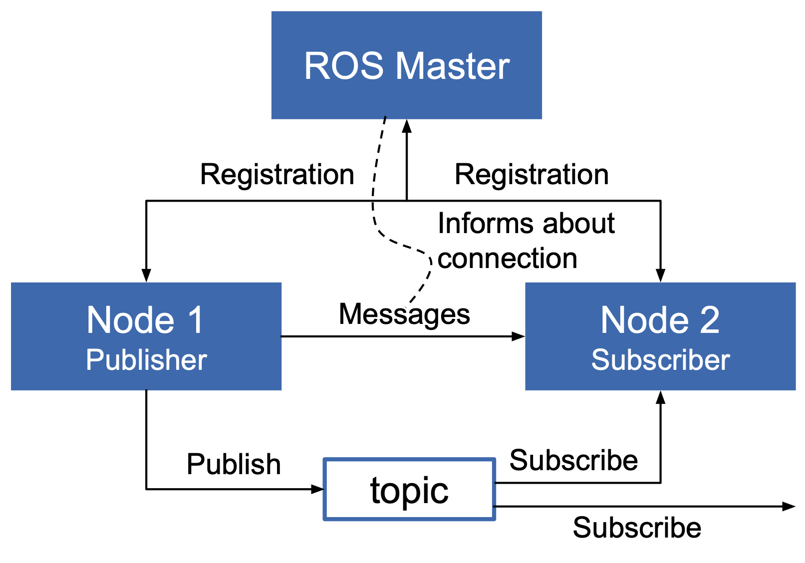
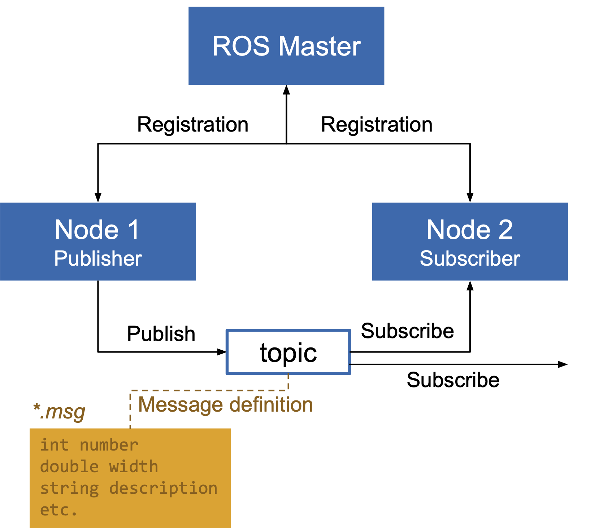

# Exercises will work in ROS {.columns}

## Robotic Operating System (ROS) {.theorem .left}

Consists of the Middleware, Algorithms and Developer tools.

##

* Developed in 2007 at the Stanford Artificial Intelligence Laboratory,
* Since 2013 managed by the Opens Science Robotic Foundation,
* ROS 2 has been redesigned as a new standard [@Koubaa2017].
 
## {.right}

{height=360px}

\

[{width=150px}](www.ros.org)

# ROS Core Ideas

ROS is used in many universities and companies as a standard for robot programming.

* Peer to peer System -- ROS is a middleware: Individual programs communicate using a given API (ROS messages, services, etc.).
* Distributed: Programs can run on multiple computers and communicate.
* Multi-lingual: ROS modules can be written in many common languages (C++, Python, MATLAB, Java, etc.).
* Light-weight communication: Stand-alone libraries are wrapped around with a thin ROS layer.
* Free and open-source: Most ROS software is open-source and free to use.

# ROS - provides a middleware {.columns}

## ROS Master {.left}

* Manages the communication between nodes (processes)
* Every node registers at startup with the master

<!--Start with: `> roscore`-->

## ROS Nodes {.center .fragment}

* Single-purpose, executable program
* Individually compiled, executed, and
managed
* Organized in packages

<!--Run: `> rosrun *package* *node*`  
See active nodes: `> rosnode list`
Get information on node: `> rosnode info *node_name*`-->

## {.right}

{width=420px}

## Topics {.bottom .fragment}

Nodes communicate over topics (name for message stream): can publish / subscribe.

## {.footer}

[@ros_course_2021]

# ROS Messages {.columns}

##  {.left}

* Data structure defining the type of a topic
* Comprised of a nested structure of integers,
floats, booleans, strings etc. and arrays of objects
* Defined in *.msg files

## {.right}

{height=450px}

## {.footer}

[@ros_course_2021]

# Exercises: Using an Online Learning Plattform 

::: columns-60-40

{height=420px}

* In the exercise, we will use for simulation [the ConstructSim](https://www.theconstructsim.com) learning plattform: 
	* introduction to Python 
	* and ROS, 
	* afterwards applying this on simple robotic example tasks and using common ROS libraries.
* [Register ONE](https://app.theconstructsim.com/) person per exercise group NOW -- and [send a mail](mailto:malte.schilling@uni-muenster.de) to me!
:::

