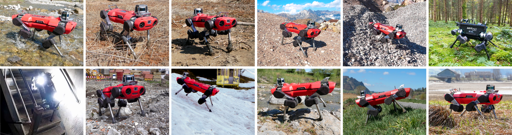
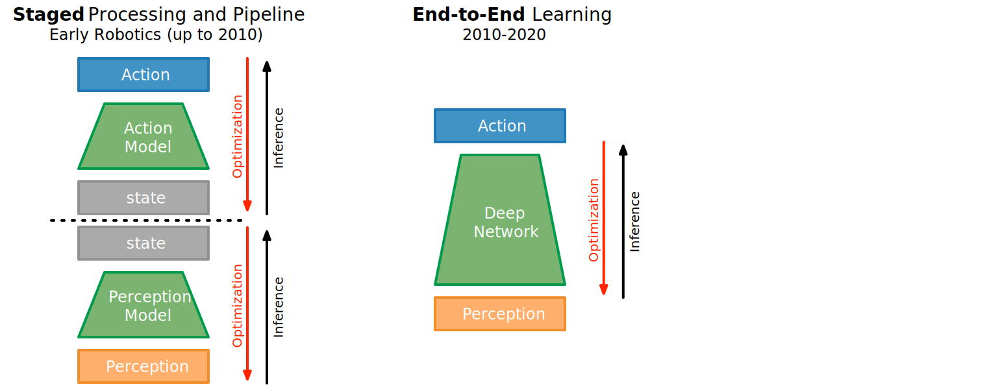

# Learning Locomotion {.section data-background-color="#6A931C"}

# Promise of Learning

::: incremental 

- Many seemingly simple tasks are hard to describe in a formal way.
- Nonetheless, humans are quite good to solve such problems and manage such tasks.
- Crucial is the ability to learn which is a characteristic and prerequisite for intelligent behavior.
- Machine Learning in general aims at learning how to solve a task through training instead of relying on a formal description.

:::

# Learning is the answer to a number of important questions:

::: incremental

- How to enhance limited knowledge and skills?
- How to improve performance on a task?
- How to avoid prestructuring everything by hand?
- How to cope with novelty and change?
- How to get around in a world that can only partially be known?
:::

# Learning as crucial for real-world robotics and interaction

::: r-stack
{ height=500px }
{ height=500px .fragment }
{ height=500px .fragment }
:::

# Example: Learning Quadrupedal Locomotion over Challenging Terrain

{width=1200px}

## {.footer}

Robotic Systems Lab, ETH Zürich, [@lee2020].

# Robot System: ANYmal {.columns}

## Hardware {.left}

* quadrupedal robot designed for autonomous operation,
* compliant and precisely torque controllable actuators, 
* 12 Degrees of Freedom
* batteries for more than 2h autonomy
* machine weighs less than 30kg

Capabilities: dynamic running and high-​mobile climbing. 

## {.right}

{width=600px}

## {.footer}

[@lee2020]

# Robot System: ANYmal {.columns}

##  {.left}

| Specification         |                                     |
|--------------|--------------------------------------------|
| Weight | 30 kg                |
| Height | 0.5 m |
| Actuation | 3 actuated compliant joint modules |
| Joint rotation | 360° |
| Link length | 250 mm | 
| Control frequ. | +70 Hz |
| Battery life | 2-4 hrs, auton. op.  |
| Power batt. | 650 Wh |

## {.right}

{width=600px}

## {.footer}

[@lee2020]

# Robot System: ANYmal {.columns}

## Sensors {.left}

Environmental perception 

* 4 Optofoce sensors used as tactile feet
* 2 Rotating Hokuyo UTM-30LX LIDAR sensors in the front
* 2 Wide-angle cameras in front & back

Joint measurements in drives.
Can be equipped with different sensory equipment such as optical and thermal cameras, microphones, gas-​detection sensors and active lighting.

## {.right}

{width=600px}

## {.footer}

[@lee2020]

# Learning-based Control Approach 

{height=400px}

## {.footer}

[@lee2020]

# Learning-based Control Approach 

::: columns-40-60

* (A) Two-stage training process:
	* teacher policy in RL in simulation using privileged information
	* a proprioceptive student policy learns by imitating the teacher, but can only use data available on the robot
* (B) Adaptive terrain curriculum (keep it challenging).

{height=480px}

:::

## {.footer}

[@lee2020]

# Training: Visualizing Adaptive Curriculum

{width=800px}

## {.footer}

[@lee2020]

# Results: In Natural Environments 

::: columns-2-1

|      Quantity      | Controller |       | Terrain |            |
|:------------------:|:----------:|:-----:|:-------:|:----------:|
|                    |            |  Moss |   Mud   | Vegetation |
|    Average Speed   |    Ours    | 0.452 |  0.338  |    0.248   |
|        (m/s)       |  Baseline  | 0.199 |  0.197  |      /     |
| Average mechanical |    Ours    | 0.423 |  0.692  |    1.23    |
|         CoT        |  Baseline  | 0.625 |  0.931  |      /     |

{height=360px}

:::

## {.footer}

[@lee2020]

# Results: Testing Robustness 

{width=900px}

Controlled experiments (D) on steps, 10 kg payload; (E) Success rates for different step heights (10 trials each); (F) Mean linear speed, (G) Mean heading errors on flat terrain.

## {.footer}

[@lee2020]

# Summary: Learning Quadrupedal Locomotion

{height=480px start="0"}

## {.footer}

[@lee2020]

# SoTA: Learning-based Control Approach for Quadrupedal Walking

::: r-stack
{height=400px}
{ height=400px .fragment }
:::

Learning is only part of the solution on a higher level (slow, 50 Hz) and on lower level uses traditional methods (400 Hz).

## {.footer}

[@lee2020]

# Perception-Action Coupling

::: r-stack

{width=1200px}
{width=1200px .fragment}
{width=1200px .fragment}

:::